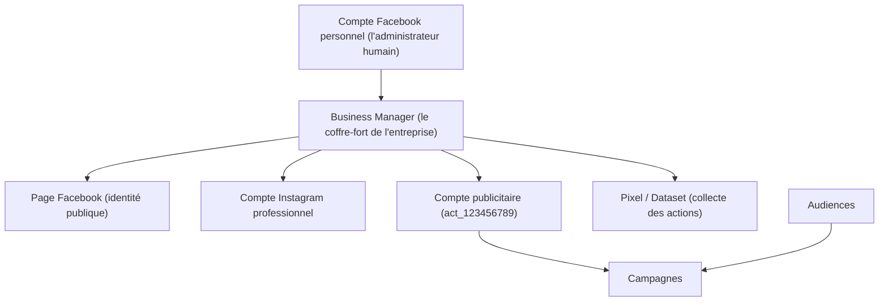
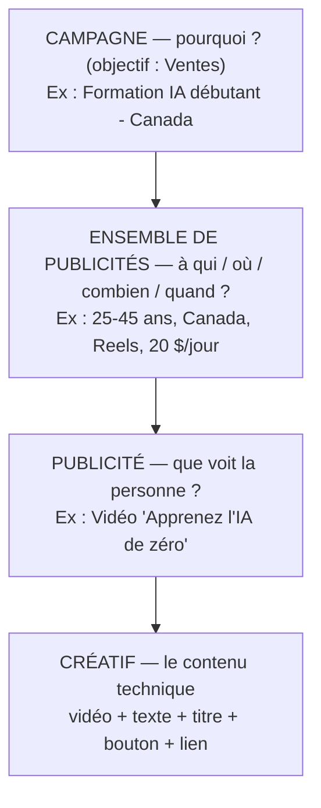
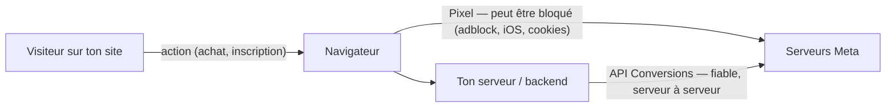
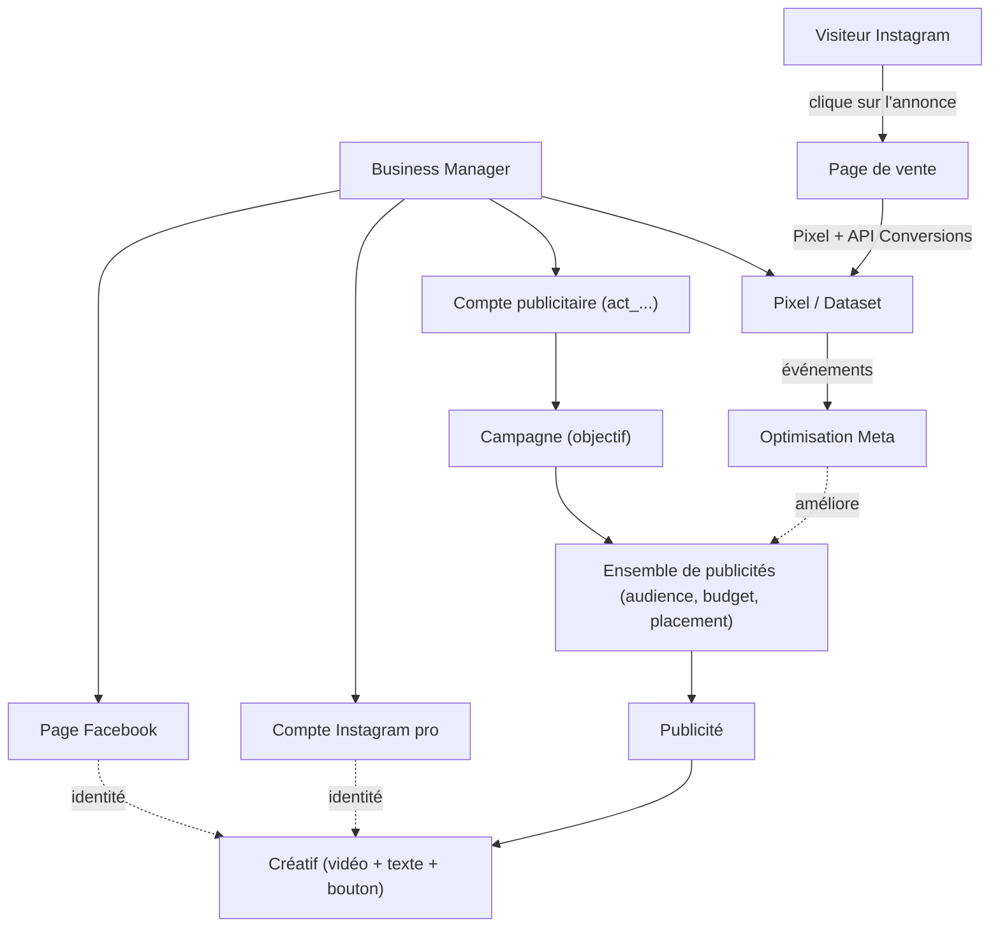

# Leçon 1 — Comprendre l'écosystème Meta Ads et Instagram Ads

> [!TIP]
> **Objectif de la Leçon 1 — Comprendre _le terrain de jeu_ avant de jouer.**
>
> Cette première leçon est entièrement théorique : on ne touche ni au code, ni à n8n, ni aux API. On apprend simplement à parler le langage de Meta, parce qu'on ne peut pas automatiser un système qu'on ne comprend pas.
>
> À la fin de cette leçon, tu sauras expliquer avec tes propres mots :
> 1. Ce qu'est **Meta Ads** et pourquoi Instagram passe par lui.
> 2. La différence entre une **Page Facebook**, un **compte Instagram professionnel** et un **compte publicitaire**.
> 3. La structure en trois niveaux : **campagne → ensemble de publicités → publicité**.
> 4. Ce qu'est un **Pixel Meta**, une **API Conversions** et une **Marketing API**, et surtout en quoi ils diffèrent.
>
> Retiens dès maintenant la phrase la plus importante de tout le cours : **une campagne n'est pas une publicité.** Une campagne est une intention stratégique ; la publicité est l'annonce réelle que la personne voit défiler sur son écran. Confondre les deux est l'erreur numéro un des débutants, et tout le reste de la formation repose sur cette distinction.

## 1.1 C'est quoi Meta Ads

Meta Ads est la régie publicitaire de l'entreprise Meta, c'est-à-dire le système unique qui permet de créer, de payer et de diffuser des publicités sur l'ensemble des plateformes appartenant à Meta. Quand tu lances une publicité, tu ne la crées pas « dans Instagram » ni « dans Facebook » séparément : tu la crées dans Meta Ads, puis tu choisis sur quelles vitrines elle apparaîtra.

Ces vitrines, que Meta appelle des « placements », incluent principalement Facebook, Instagram, Messenger et l'Audience Network (un réseau d'applications partenaires). C'est pour cette raison que faire de la publicité sur Instagram revient, techniquement, à utiliser Meta Ads en cochant Instagram comme destination.

> [!NOTE]
> **Analogie.** Imagine une grande régie publicitaire qui possède plusieurs panneaux d'affichage dans la ville : un dans le centre commercial (Facebook), un dans la station de métro la plus fréquentée (Instagram), un dans la boîte aux lettres des gens (Messenger). Tu ne négocies pas avec chaque panneau séparément : tu vas voir la régie une seule fois, tu donnes ton affiche et ton budget, et **c'est elle qui décide où coller ton affiche** pour obtenir le meilleur résultat. Meta Ads, c'est cette régie centrale.

Il faut aussi distinguer deux mondes qui se ressemblent mais n'ont rien à voir. La **publicité organique** correspond aux publications normales que tu postes gratuitement et que seuls tes abonnés (ou presque) voient. La **publicité payante** correspond à du contenu que tu paies pour montrer à des personnes choisies, même si elles ne te connaissent pas encore. De la même manière, « booster une publication » est un raccourci simplifié qui transforme un post existant en mini-publicité, alors que « créer une campagne » est la démarche professionnelle complète sur laquelle repose toute cette formation, car c'est la seule qui permet un vrai contrôle et une vraie automatisation.

## 1.2 Les grands objets de Meta Business (vue d'ensemble)

Avant de plonger dans les détails, il est essentiel de voir comment tous les éléments de l'écosystème s'emboîtent les uns dans les autres. Meta organise tout autour d'un espace central appelé le **Business Manager** (aussi nommé « Portefeuille Business »), qui sert de coffre-fort contenant toutes tes ressources professionnelles.

Voici les objets principaux que tu rencontreras, expliqués simplement :

- Le **compte Facebook personnel** est ton identité humaine ; c'est la personne réelle qui administre les outils, mais ce n'est jamais lui qui « possède » la publicité.
- Le **Business Manager** est l'espace professionnel qui regroupe et protège toutes les ressources de l'entreprise.
- La **Page Facebook** est l'identité publique de la marque ou de l'entreprise.
- Le **compte Instagram professionnel** est le compte Instagram utilisé pour diffuser les publicités.
- Le **compte publicitaire** contient les campagnes, les budgets et la facturation.
- Le **Pixel** (et son conteneur, le **Dataset**) collecte les actions des visiteurs sur ton site.
- Les **audiences** sont les groupes de personnes que tu veux cibler.
- Les **campagnes** sont les structures publicitaires que tu vas créer et automatiser.

Le diagramme suivant montre comment ces objets s'emboîtent, du plus général au plus précis :



> [!NOTE]
> **Analogie.** Le Business Manager est comme l'immeuble de bureaux d'une entreprise. La Page Facebook et le compte Instagram sont la façade et l'enseigne visibles depuis la rue. Le compte publicitaire est le service comptabilité-marketing qui gère le budget. Le Pixel est la caméra à l'entrée qui note qui entre et ce qu'ils font. Tout est sous le même toit, mais chaque pièce a un rôle précis.

## 1.3 La Page Facebook

La Page Facebook est l'identité publique de ton activité : c'est la « vitrine officielle » de ton entreprise, de ton école ou de ta marque sur Meta. Elle porte un nom (par exemple « Formation IA Débutant »), une photo, une description, et c'est en son nom que les publicités sont diffusées.

Un point qui surprend beaucoup de débutants : **même si tu veux faire de la publicité uniquement sur Instagram, une Page Facebook reste presque toujours nécessaire.** La raison est que Meta relie l'identité commerciale de tes publicités à une Page Facebook ; c'est elle qui « signe » l'annonce, même lorsque celle-ci s'affiche dans le fil Instagram d'un utilisateur.

Il ne faut surtout pas confondre la Page avec ton profil personnel. Ton **profil personnel** représente une personne réelle (toi) et sert à administrer les outils. La **Page**, elle, représente une organisation et peut être gérée par plusieurs personnes. Enfin, la Page se connecte au compte Instagram professionnel : c'est ce lien entre les deux qui permet à une seule publicité d'apparaître à la fois sur Facebook et sur Instagram, avec une identité de marque cohérente.

## 1.4 Le compte Instagram professionnel

Instagram propose trois types de comptes, et la distinction est importante. Le **compte personnel** est le compte par défaut, pensé pour un usage privé. Le **compte créateur** est destiné aux influenceurs et aux personnalités publiques. Le **compte professionnel** (parfois appelé « compte business ») est conçu pour les entreprises et c'est celui dont tu as besoin.

Pourquoi un compte professionnel ? Parce que c'est lui qui débloque les fonctionnalités indispensables à la publicité : la possibilité de diffuser des annonces payantes, l'accès aux statistiques détaillées, et surtout la connexion au Business Manager et à une Page Facebook. Sans cette connexion, Meta ne peut pas associer tes publicités à ton compte Instagram.

Concrètement, c'est ce compte Instagram professionnel qui apparaîtra comme l'auteur de tes publicités dans les **Reels**, les **Stories** et le **Feed**. Quand un utilisateur verra ta publicité et cliquera sur le nom du compte en haut de l'annonce, c'est ton compte Instagram professionnel qu'il découvrira.

## 1.5 Le compte publicitaire

Le compte publicitaire est l'espace qui contient tout ce qui touche à l'argent et à l'organisation de tes publicités. C'est lui qui regroupe les campagnes, les ensembles de publicités, les annonces, les budgets, la méthode de paiement, la devise, le fuseau horaire et les permissions des différentes personnes qui y ont accès.

On peut le voir comme le **portefeuille et le classeur** de tes opérations publicitaires : sans compte publicitaire, tu ne peux ni dépenser un centime, ni organiser quoi que ce soit. Chaque compte publicitaire possède un identifiant unique qui ressemble à ceci :

```
act_123456789
```

Garde bien cet identifiant en tête, car il jouera un rôle central plus tard dans la formation. Lorsque nous automatiserons la création de campagnes avec la Meta Marketing API (en Leçon 4 et 5), c'est précisément cet identifiant `act_...` que notre code utilisera pour dire à Meta : « crée cette campagne **dans ce compte publicitaire précis** ».

## 1.6 La structure publicitaire en trois niveaux

Toute publicité Meta repose sur une hiérarchie en trois étages. Comprendre cette pyramide est sans doute la chose la plus utile de toute la leçon, car c'est exactement cette structure que ton automatisation devra reproduire ligne par ligne.

Le premier niveau, la **campagne**, répond à la question « **pourquoi ?** ». C'est l'objectif marketing : veux-tu des ventes, des prospects (leads), du trafic, de la notoriété ? La campagne ne contient ni image, ni texte, ni budget de ciblage ; elle ne fait que définir l'intention générale.

Le deuxième niveau, l'**ensemble de publicités** (en anglais « ad set »), répond aux questions « **à qui ? où ? combien ? quand ?** ». C'est ici que tu définis ton audience (pays, âge, centres d'intérêt), tes placements (Feed, Stories, Reels), ton budget quotidien et ton calendrier de diffusion.

Le troisième niveau, la **publicité** (en anglais « ad »), répond à la question « **que voit la personne ?** ». C'est l'annonce réelle : la vidéo, le texte, le titre, le bouton et le lien. Le contenu visuel et textuel de cette publicité est techniquement décrit par un objet appelé le **créatif** (« creative »).



> [!NOTE]
> **Analogie.** Pense à l'organisation d'un spectacle. La **campagne** est le but de la soirée (« vendre des billets »). L'**ensemble de publicités** est le choix de la salle, du public invité et du budget de location. La **publicité** est l'affiche concrète que les gens voient, avec son visuel et son slogan. Un même but (vendre des billets) peut utiliser plusieurs salles différentes, et chaque salle peut afficher plusieurs affiches : c'est exactement ainsi que fonctionnent les trois niveaux de Meta.

## 1.7 Différence entre campagne, ad set, ad et creative

Cette confusion est si fréquente qu'elle mérite un récapitulatif clair. Le tableau suivant résume le rôle de chaque niveau :

| Objet | Question | Contient | Exemple |
|-------|----------|----------|---------|
| Campagne | Pourquoi ? | L'objectif marketing | « Vendre la formation IA » |
| Ensemble de publicités | À qui / où / combien / quand ? | Audience, budget, placements, calendrier | « 25-45 ans, Canada, Reels, 20 $/jour » |
| Publicité | Que voit la personne ? | L'annonce diffusée | « La vidéo n°1 avec son texte » |
| Créatif | À quoi ressemble l'annonce ? | Vidéo, image, texte, titre, bouton, lien | « video1.mp4 + Apprenez l'IA de zéro » |

Reformulé en une phrase pour bien ancrer l'idée : la campagne fixe **l'intention**, l'ensemble de publicités décide **du contexte de diffusion**, la publicité est **ce qui est montré**, et le créatif est **la matière visuelle et textuelle** dont la publicité est faite. Une seule campagne peut contenir plusieurs ensembles de publicités, et un seul ensemble peut contenir plusieurs publicités : c'est cette possibilité de démultiplier qui rendra l'automatisation si puissante en fin de formation.

## 1.8 Les publicités Instagram

Maintenant que la structure est claire, regardons concrètement où tes publicités peuvent apparaître sur Instagram. Meta appelle ces emplacements des « placements », et les principaux sont les suivants.

Le **Feed** est le fil principal d'Instagram : ta publicité s'insère entre les publications normales que l'utilisateur fait défiler. Les **Stories** sont les contenus verticaux et éphémères affichés en plein écran en haut de l'application ; ton annonce apparaît entre les stories des comptes que la personne suit. Les **Reels** sont les vidéos courtes et verticales, le format aujourd'hui le plus puissant pour capter l'attention, où ta publicité se glisse entre deux Reels organiques. Enfin, **Explore** est l'onglet de découverte où Instagram propose du contenu nouveau, et où ta publicité peut surgir pendant que l'utilisateur explore.

Pour vendre une formation, la **vidéo** est presque toujours le format le plus efficace, car elle permet de raconter une histoire, de montrer une preuve et de créer une connexion. Mais attention : sur Instagram, tout se joue dans les **trois premières secondes**. Si ta vidéo n'accroche pas immédiatement (par une promesse forte, une question ou une image surprenante), l'utilisateur fera défiler et ton budget sera dépensé pour rien. Cette règle des trois secondes guidera la conception de tes vidéos publicitaires dans la Leçon 3.

## 1.9 Le Pixel Meta

Le Pixel Meta est un petit morceau de code JavaScript que l'on installe sur les pages d'un site web. Son rôle est d'observer ce que font les visiteurs et de rapporter ces actions à Meta sous forme d'« événements ». Grâce à lui, Meta apprend non seulement que quelqu'un a cliqué sur ta publicité, mais aussi ce qu'il a fait ensuite sur ton site.

Les événements les plus courants que le Pixel peut signaler sont, par exemple : `PageView` (une page a été vue), `ViewContent` (une page importante comme une fiche produit a été consultée), `Lead` (une personne a laissé ses coordonnées), `InitiateCheckout` (un paiement a été commencé) et `Purchase` (un achat a été finalisé).

> [!NOTE]
> **Analogie.** Le Pixel est comme une **caméra de surveillance discrète** installée à l'intérieur de ta boutique. Elle ne sert pas à espionner pour le plaisir, mais à comprendre le parcours des clients : par quelle porte ils entrent, quels rayons ils regardent, et lesquels passent réellement à la caisse. Ces informations permettent ensuite à Meta de retrouver « des gens qui ressemblent à tes acheteurs » et de leur montrer tes publicités.

Ce rôle est fondamental : sans Pixel, Meta diffuse tes publicités presque à l'aveugle. Avec un Pixel bien installé, Meta peut **optimiser** automatiquement la diffusion vers les personnes les plus susceptibles d'acheter, ce qui fait toute la différence entre un budget gaspillé et un budget rentable.

## 1.10 L'API Conversions

Le Pixel a une faiblesse : comme il fonctionne dans le navigateur du visiteur, il peut être bloqué ou limité par les bloqueurs de publicité, les réglages de confidentialité d'iOS, les restrictions sur les cookies ou les navigateurs très stricts. Quand le Pixel est bloqué, l'information n'arrive jamais jusqu'à Meta, et tu « perds » des conversions que tu as pourtant réellement obtenues.

C'est exactement le problème que résout l'**API Conversions** (souvent abrégée en CAPI, pour *Conversions API*). Au lieu d'envoyer les événements depuis le navigateur, **ton serveur les envoie directement aux serveurs de Meta**, de machine à machine. Cette connexion serveur à serveur ne dépend ni du navigateur, ni des cookies, ni des bloqueurs : elle est donc beaucoup plus fiable.



La stratégie recommandée par Meta n'est pas de choisir l'un ou l'autre, mais d'utiliser **le Pixel ET l'API Conversions en même temps** : le navigateur envoie l'événement quand il le peut, et le serveur l'envoie de toute façon, ce qui garantit que Meta reçoit l'information. Cela soulève cependant une question : si les deux envoient le même achat, Meta ne risque-t-il pas de le compter deux fois ? La réponse est la **déduplication**, un mécanisme que nous détaillerons entièrement dans la Leçon 2.

## 1.11 La Meta Marketing API

Il est crucial de ne pas confondre l'API Conversions avec la Meta Marketing API, car elles servent à des choses opposées. L'**API Conversions sert à _envoyer des informations_ vers Meta** : elle remonte les événements (« quelqu'un a acheté »). La **Meta Marketing API sert à _créer et gérer_ les publicités** : elle permet de fabriquer par le code une campagne, un ensemble de publicités, un créatif et une annonce, exactement comme si tu cliquais dans l'interface, mais automatiquement.

| API | Direction | Sert à |
|-----|-----------|--------|
| API Conversions | Toi → Meta (données) | Remonter les événements et conversions |
| Marketing API | Toi → Meta (commandes) | Créer et piloter les campagnes et publicités |

C'est cette Marketing API qui sera le **moteur de notre automatisation finale** en Leçon 5. Lorsque tu rempliras une ligne dans Google Sheets ou Airtable et que n8n la lira, ce sont des appels à la Marketing API qui transformeront cette ligne en une vraie campagne Instagram : création de la campagne, puis de l'ensemble de publicités, puis envoi de la vidéo, puis création du créatif, puis de la publicité. Sans la Marketing API, aucune automatisation de création ne serait possible.

## 1.12 Vue globale du système (synthèse)

Rassemblons maintenant toutes les pièces dans une seule image mentale. D'un côté, il y a la **branche de création** des publicités, qui descend du Business Manager jusqu'aux créatifs, et qui sera pilotée par la Marketing API. De l'autre côté, il y a la **branche de mesure**, où le Pixel et l'API Conversions font remonter vers Meta ce que font les visiteurs, afin d'alimenter l'optimisation.



Ce schéma résume toute la logique de la formation : on **crée** des publicités en descendant la hiérarchie (campagne → ad set → ad → créatif), et on **mesure** les résultats en faisant remonter les événements (Pixel et API Conversions). L'optimisation de Meta fait ensuite le pont entre les deux, en utilisant les données de mesure pour mieux diffuser les publicités créées.

## Recap

> [!TIP]
> **Avant de passer à la Leçon 2, assure-toi de pouvoir réexpliquer ces 11 notions avec tes propres mots :**
>
> 1. Ce qu'est **Meta Ads** et pourquoi Instagram passe par lui.
> 2. La différence entre **publicité organique** et **publicité payante**.
> 3. Le rôle de la **Page Facebook** et pourquoi elle reste nécessaire pour Instagram.
> 4. Ce qu'est un **compte Instagram professionnel**.
> 5. Ce qu'est un **compte publicitaire** et son identifiant `act_...`.
> 6. La structure en trois niveaux : **campagne → ensemble de publicités → publicité**.
> 7. La différence entre une **publicité** et un **créatif**.
> 8. Les placements Instagram : **Feed, Stories, Reels, Explore**.
> 9. Ce qu'est le **Pixel Meta** et pourquoi il peut être bloqué.
> 10. Ce qu'est l'**API Conversions** et pourquoi on la combine avec le Pixel.
> 11. La différence entre l'**API Conversions** (envoyer des événements) et la **Marketing API** (créer des publicités).
>
> **Et n'oublie jamais la phrase fondatrice : une campagne n'est pas une publicité.**

Dans la **Leçon 2**, nous quitterons la théorie générale pour entrer dans le tracking concret : nous verrons les événements standards de Meta en détail, comment installer le Pixel et l'API Conversions, quelles données sont envoyées, et surtout comment fonctionne la **déduplication** qui évite de compter deux fois le même achat lorsque le Pixel et l'API Conversions travaillent ensemble.
