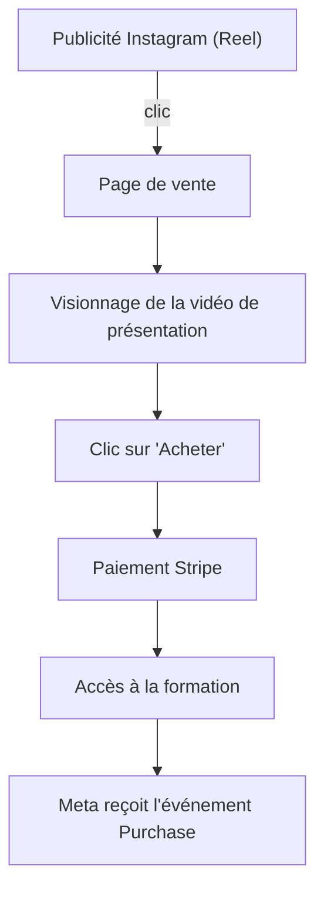
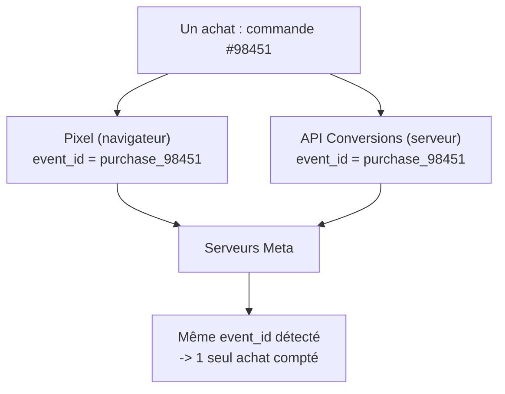

# Leçon 2 — Tracking : Pixel Meta et API Conversions

> [!TIP]
> **Objectif de la Leçon 2 — Savoir _mesurer_ ce qui se passe après le clic.**
>
> Dans la Leçon 1, tu as compris l'architecture de Meta. Ici, tu apprends à **suivre les actions des visiteurs** : qui visite, qui s'inscrit, qui achète. Sans ce suivi (le « tracking »), tu dépenses ton budget à l'aveugle.
>
> À la fin de cette leçon, tu sauras :
> 1. Reconnaître les **événements standards** de Meta et choisir ceux qui comptent vraiment.
> 2. Comprendre la différence entre le **Pixel** (navigateur) et l'**API Conversions** (serveur).
> 3. Expliquer la **déduplication** avec `event_id` pour ne pas compter deux fois le même achat.
> 4. Comprendre l'**Event Match Quality** et quelles données améliorent la mesure.
>
> Phrase clé de cette leçon : **on n'optimise bien que ce qu'on mesure bien.**

## 2.1 Pourquoi le tracking est indispensable

Faire de la publicité sans tracking, c'est comme ouvrir un magasin sans jamais regarder la caisse : tu vois de l'agitation, mais tu ne sais pas si tu gagnes ou perds de l'argent. Le tracking sert exactement à relier une dépense publicitaire à un résultat réel.

Concrètement, le tracking permet trois choses fondamentales. D'abord, il permet à Meta d'**optimiser automatiquement** la diffusion : si Meta sait qui achète, il ira chercher des personnes qui leur ressemblent. Ensuite, il permet de **mesurer** ton retour sur investissement : combien t'a coûté chaque vente. Enfin, il permet d'**attribuer** correctement les conversions : savoir quelle vidéo, quelle audience et quelle campagne ont réellement généré les ventes.

> [!NOTE]
> **Analogie.** Sans tracking, Meta est un livreur à qui tu donnes des colis sans adresse : il distribue au hasard. Avec un bon tracking, tu lui donnes les adresses de tes meilleurs clients passés, et il apprend à reconnaître les quartiers où vivent les gens qui achètent. Le tracking, c'est l'adresse qui rend la livraison intelligente.

## 2.2 Le parcours utilisateur

Pour bien suivre, il faut d'abord visualiser le chemin complet d'un visiteur, depuis la publicité jusqu'à l'achat. Reprenons notre fil rouge, la « Formation IA débutant ».

Chaque étape de ce parcours peut devenir un **événement** envoyé à Meta. Plus tu envoies d'informations fiables sur ce parcours, plus Meta comprend ce qui fonctionne et plus il optimise efficacement la diffusion de tes futures publicités.

## 2.3 Les événements standards de Meta

Meta reconnaît une liste d'événements « standards », c'est-à-dire des actions au nom prédéfini qu'il sait interpréter. Les connaître permet de parler le même langage que la plateforme. Voici les plus utiles :

| Événement | Signification |
|-----------|---------------|
| `PageView` | Une page a été vue |
| `ViewContent` | Une page importante (fiche du cours) a été consultée |
| `Search` | Une recherche a été effectuée |
| `Lead` | Une personne a laissé ses coordonnées |
| `CompleteRegistration` | Une personne a créé un compte |
| `AddToCart` | Un produit a été ajouté au panier |
| `InitiateCheckout` | Un paiement a été commencé |
| `AddPaymentInfo` | Des informations de paiement ont été saisies |
| `Purchase` | Un achat a été finalisé |
| `Contact` | Une personne a contacté l'entreprise |
| `Subscribe` | Une personne s'est abonnée |

## 2.4 Événements faibles et événements forts

Tous les événements n'ont pas la même valeur. Un **événement faible** est une action peu engageante, comme une simple visite de page (`PageView`) : beaucoup de gens la déclenchent, mais elle prouve peu d'intérêt réel. Un **événement fort** est une action coûteuse en intention, comme un `Lead`, une `CompleteRegistration` ou un `Purchase` : peu de gens la déclenchent, mais elle a une vraie valeur business.

Pour vendre une formation, les événements les plus intéressants à optimiser sont généralement `ViewContent` (la personne s'intéresse au cours), `Lead` (elle a laissé son email), `InitiateCheckout` (elle a commencé à payer) et `Purchase` (elle a acheté). Plus tu demandes à Meta d'optimiser vers un événement fort, plus les personnes ciblées seront qualifiées, mais plus elles seront rares et chères à atteindre. C'est un arbitrage que tu apprendras à régler.

## 2.5 Le Pixel Meta côté navigateur

Le Pixel est un code JavaScript que tu places sur ton site. Il s'exécute dans le navigateur du visiteur et envoie les événements à Meta au fur et à mesure des actions. Son installation varie selon ta plateforme :

- Sur **WordPress**, on utilise généralement une extension officielle qui pose le code automatiquement.
- Sur **Shopify**, le Pixel se connecte via les réglages marketing intégrés.
- Sur **Thinkific**, on colle souvent le code dans les paramètres de code personnalisé du site.
- Avec **Google Tag Manager**, on déploie le Pixel comme une balise, sans toucher au code source.
- Sur un **site personnalisé** (HTML, Next.js), on insère le code manuellement dans les pages.

Quelle que soit la méthode, l'étape la plus importante est la **vérification** : l'outil « Gestionnaire d'événements » (Events Manager) de Meta te montre en temps réel les événements reçus, ce qui te permet de confirmer que le Pixel fonctionne avant de dépenser le moindre euro.

## 2.6 L'API Conversions côté serveur

Comme vu en Leçon 1, le Pixel peut être bloqué (adblock, iOS, cookies). L'API Conversions (CAPI) résout ce problème en envoyant les événements **depuis ton serveur**, directement aux serveurs de Meta.

Dans la pratique, l'API Conversions est déclenchée par ton backend ou par un outil intermédiaire. Par exemple : ton serveur web, un outil d'automatisation comme **n8n**, le système de paiement **Stripe**, ta base de données **Supabase**, ton **CRM**, ou un **webhook** qui réagit à un événement. Quand l'un de ces systèmes confirme une action réelle (un paiement validé, par exemple), il appelle l'API Conversions pour en informer Meta de façon fiable, sans dépendre du navigateur.

## 2.7 Les données envoyées à Meta

Un événement n'est pas qu'un nom : il transporte des informations qui aident Meta à comprendre et à rattacher l'action à une personne. Voici les champs les plus importants.

D'un côté, les **données de l'événement** décrivent l'action : `event_name` (le type, ex. `Purchase`), `event_time` (le moment), `event_id` (l'identifiant unique, crucial pour la déduplication), `action_source` (l'origine : site web, application, etc.) et `event_source_url` (la page concernée). On y ajoute souvent des `custom_data` comme `currency`, `value` (le montant), `content_name` ou `content_ids`.

De l'autre côté, les **données utilisateur** (`user_data`) aident à reconnaître la personne : email haché, téléphone haché, adresse IP, user agent, et les identifiants de navigateur `fbp` et `fbc`. Les informations sensibles comme l'email ou le téléphone sont **hachées** (transformées en code irréversible) avant l'envoi, pour respecter la confidentialité tout en permettant la correspondance.

> [!NOTE]
> **Le hachage en deux mots.** Hacher une donnée, c'est la passer dans une moulinette mathématique qui produit toujours le même résultat illisible. Meta ne voit jamais l'email en clair, mais si ton serveur et Meta hachent « jean@exemple.com » de la même façon, les deux codes coïncident et Meta reconnaît la personne, sans jamais lire l'adresse réelle.

## 2.8 La déduplication Pixel + API Conversions

Voici le point le plus délicat de la leçon. Quand tu utilises le Pixel **et** l'API Conversions, le même achat peut être envoyé deux fois : une fois par le navigateur, une fois par le serveur. Sans précaution, Meta compterait deux ventes là où il n'y en a qu'une, faussant complètement tes statistiques.

La solution est la **déduplication** grâce à un identifiant partagé, l'`event_id`. Si le Pixel et l'API Conversions envoient le même `event_id` pour le même achat, Meta comprend qu'il s'agit d'un seul et même événement et n'en garde qu'un.

La règle d'or est donc simple : **génère un identifiant unique par action réelle** (par exemple à partir du numéro de commande) et utilise exactement le même côté navigateur et côté serveur.

## 2.9 L'Event Match Quality

L'« Event Match Quality » (qualité de correspondance des événements) est une note que Meta attribue à tes événements serveur. Elle indique à quel point les informations envoyées permettent de **rattacher l'événement à un vrai compte Meta**. Plus la note est haute, mieux Meta peut attribuer la conversion et optimiser.

Cette qualité dépend des données utilisateur que tu envoies : plus tu fournis de paramètres fiables (email haché, téléphone haché, prénom, nom, ville, pays, identifiant externe, `fbp`, `fbc`), meilleure est la correspondance. Il ne s'agit pas d'espionner, mais de donner à Meta assez d'indices pour reconnaître que la personne qui a acheté est bien celle qui avait vu la publicité, le tout dans le respect des règles de confidentialité.

## 2.10 Tracking concret pour une plateforme de formation

Reprenons notre fil rouge et associons chaque étape du tunnel de vente à un événement précis. C'est ce « plan de tracking » que tu mettras en place avant toute campagne.

| Étape du visiteur | Événement Meta |
|-------------------|----------------|
| Visite de la page du cours | `ViewContent` |
| Formulaire de contact rempli | `Lead` |
| Création d'un compte | `CompleteRegistration` |
| Début du paiement | `InitiateCheckout` |
| Paiement réussi | `Purchase` |
| Abonnement mensuel souscrit | `Subscribe` |

## 2.11 Tracking avec Stripe

Stripe est un cas idéal pour l'API Conversions, car un paiement est un événement fiable côté serveur. Le mécanisme typique est le suivant : Stripe confirme un paiement réussi et envoie un **webhook** à ton serveur (ou à n8n). Ce dernier récupère le montant et l'email de l'acheteur, puis appelle l'API Conversions pour envoyer un événement `Purchase` à Meta, avec la valeur et la devise. Comme cet événement vient du serveur, il n'est jamais bloqué par un adblock : tu captures donc tes ventes de façon quasi certaine.

## 2.12 Tracking avec Supabase

Avec Supabase, la logique est similaire mais déclenchée par ta base de données. Lorsqu'un utilisateur est créé ou qu'une commande est insérée dans une table, une fonction serveur (ou un webhook de base de données) réagit à cet enregistrement et envoie l'événement correspondant à Meta, par exemple `CompleteRegistration` pour une inscription ou `Purchase` pour une commande validée. C'est particulièrement pratique quand ton application gère elle-même ses comptes et ses commandes.

## 2.13 Tracking avec Thinkific ou WordPress

Sur les plateformes plus fermées comme Thinkific, tu poses le Pixel pour suivre les pages et les formulaires, mais l'accès au serveur est limité. Pour les événements forts (achat, inscription), on passe alors souvent par un outil intermédiaire — **n8n**, Make ou Zapier — qui écoute un déclencheur de la plateforme et envoie ensuite l'événement à l'API Conversions. Sur WordPress, tu disposes de plus de liberté : extensions pour le Pixel, et webhooks ou code serveur pour la CAPI, notamment avec WooCommerce pour les achats.

## Recap

> [!TIP]
> **Avant la Leçon 3, assure-toi de pouvoir réexpliquer :**
>
> 1. Pourquoi le tracking est indispensable pour ne pas dépenser à l'aveugle.
> 2. Les principaux **événements standards** et la différence entre événement faible et fort.
> 3. Le fonctionnement du **Pixel** (navigateur) et ses limites.
> 4. Le fonctionnement de l'**API Conversions** (serveur) et pourquoi elle est plus fiable.
> 5. Les **données** envoyées (données d'événement + données utilisateur hachées).
> 6. La **déduplication** avec un `event_id` partagé.
> 7. Ce qu'est l'**Event Match Quality** et comment l'améliorer.
> 8. Comment tracker un achat avec **Stripe**, **Supabase** ou **Thinkific/WordPress**.
>
> **Retiens : on n'optimise bien que ce qu'on mesure bien.**

Dans la **Leçon 3**, on passe de la mesure à la stratégie : comment concevoir des publicités Instagram qui vendent réellement une formation — objectifs, placements, structure d'une vidéo, écriture du texte, choix des audiences et des budgets.
