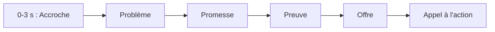
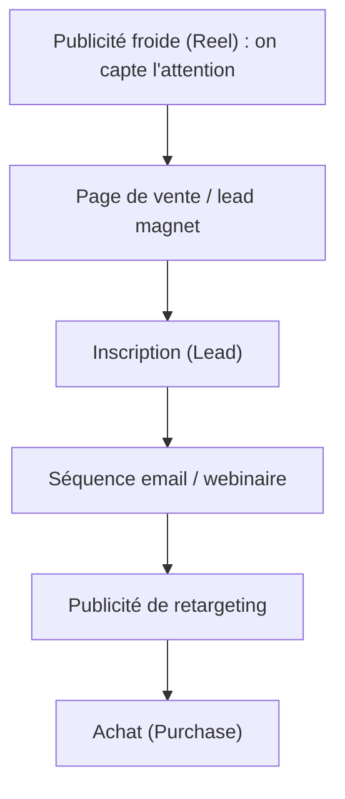

# Leçon 3 — Stratégie publicitaire Instagram pour vendre des formations

> [!TIP]
> **Objectif de la Leçon 3 — Savoir _quoi_ créer et _pourquoi_, avant de créer.**
>
> L'automatisation ne sert à rien si la stratégie est mauvaise : un mauvais message diffusé à grande échelle reste un mauvais message. Cette leçon t'apprend à penser une publicité Instagram comme un professionnel.
>
> À la fin, tu sauras :
> 1. Choisir le bon **objectif** publicitaire selon ton but.
> 2. Sélectionner les bons **placements** et **formats**.
> 3. Construire une **vidéo** et un **texte** qui vendent.
> 4. Définir des **audiences** et des **budgets** cohérents, et tester avec des **A/B tests**.
>
> Phrase clé : **une bonne publicité parle d'abord du problème du client, pas de ton produit.**

## 3.1 Ce qu'est vraiment une publicité Instagram

Il faut distinguer trois choses souvent confondues. Une **publication normale** (organique) est gratuite et touche surtout tes abonnés. **Booster une publication** est un raccourci simplifié qui paie pour montrer un post existant à plus de monde, mais avec peu de contrôle. **Créer une campagne** est la démarche professionnelle complète : tu choisis un objectif, une audience précise, un budget et un format, avec un contrôle total.

La différence essentielle est qu'une vraie publicité a toujours un **objectif clair et mesurable**. On ne fait pas de la publicité « pour être visible » de façon vague : on la fait pour obtenir des prospects, des ventes ou un autre résultat précis que l'on pourra mesurer grâce au tracking de la Leçon 2.

## 3.2 Les objectifs publicitaires

L'objectif est le premier choix que tu fais en créant une campagne, et il oriente tout le reste, car Meta optimise la diffusion en fonction de lui. Voici les grandes familles :

| Objectif | Ce que Meta cherche | Quand l'utiliser |
|----------|---------------------|------------------|
| Notoriété | Montrer la marque au plus de monde | Se faire connaître |
| Trafic | Amener des clics vers un site | Faire découvrir une page |
| Engagement | Likes, commentaires, vues vidéo | Tester un contenu |
| Prospects (Leads) | Récupérer des coordonnées | Construire une liste d'emails |
| Ventes | Déclencher des achats | Vendre directement |
| Promotion d'app | Installations d'application | Application mobile |

Pour vendre une formation en ligne, les objectifs les plus utiles sont généralement **Ventes** (quand ton tracking d'achat est fiable) et **Prospects** (pour récolter des emails et vendre ensuite). Le **Trafic** peut servir à amorcer, et l'**Engagement** à tester rapidement quelle vidéo accroche le plus.

## 3.3 Les placements Instagram

Le placement est l'endroit où ta publicité apparaît. Chacun a ses codes et son format idéal.

Le **Feed** est le fil principal : ta publicité s'y insère entre les publications, idéale pour un message qui demande un peu d'attention. Les **Stories** sont en plein écran vertical et éphémères : elles exigent un contenu immédiat et immersif. Les **Reels** sont les vidéos courtes verticales, le format le plus puissant aujourd'hui pour capter l'attention d'audiences froides. **Explore** apparaît dans l'onglet de découverte, quand l'utilisateur cherche du nouveau contenu.

> [!NOTE]
> **Conseil de format.** Le **vertical plein écran (9:16)** est aujourd'hui le format roi sur Instagram, car il occupe tout l'écran du téléphone dans les Stories et les Reels. Le carré (1:1) reste correct pour le Feed. L'horizontal (16:9), hérité de YouTube, est le moins adapté à Instagram. En cas de doute, pense « vertical d'abord ».

## 3.4 Les formats créatifs

Au-delà du placement, tu choisis un format de contenu. L'**image** est simple et rapide à produire, mais moins convaincante. La **vidéo** permet le storytelling et la preuve, c'est la plus efficace pour une formation. Le **carrousel** (plusieurs visuels que l'on fait défiler) sert à montrer plusieurs bénéfices ou étapes. Le **Reel** est une vidéo verticale native, parfaite pour l'attention rapide. La **Story** est immersive et verticale. Il existe aussi des publicités à **formulaire instantané** (la personne laisse ses coordonnées sans quitter Instagram) et des publicités à **lien externe** (elle est envoyée vers ta page de vente).

## 3.5 La structure d'une vidéo publicitaire

Une vidéo qui vend suit presque toujours la même ossature. Les **trois premières secondes** doivent accrocher (une question, une promesse forte, une image surprenante), sinon la personne fait défiler. Ensuite vient le **problème** (ce qui bloque ton client), puis la **promesse** (ce que ta formation change), puis la **preuve** (résultats, exemples, projets concrets), puis l'**offre** (ce que la personne obtient), et enfin l'**appel à l'action** (ce qu'elle doit faire maintenant).

Appliqué à notre fil rouge : *accroche* « Vous voulez utiliser l'IA mais vous ne savez pas par où commencer ? » ; *problème* « Les tutoriels sont trop techniques ou trop vagues » ; *promesse* « Une formation progressive qui part vraiment de zéro » ; *preuve* « Avec des projets concrets et des automatisations » ; *offre* « Accès à vie et exercices guidés » ; *appel à l'action* « Inscrivez-vous aujourd'hui ». La même ossature fonctionne pour une formation cybersécurité, Excel Copilot ou ChatGPT, en changeant simplement le problème et la promesse.

## 3.6 La structure du texte publicitaire

Le texte qui accompagne la vidéo suit une logique proche : une **accroche** qui arrête le défilement, le **problème** vécu par le lecteur, la **solution** que tu proposes, le **bénéfice** concret qu'il en retire, une **preuve** qui rassure, une légère **urgence** (sans mentir), et un **appel à l'action** clair. Le ton peut varier selon ton public : professionnel, direct, pédagogique ou émotionnel. La règle constante reste celle de la phrase clé : **parle d'abord du problème du lecteur, ton produit n'arrive qu'ensuite comme la solution.**

## 3.7 Les audiences

L'audience définit à qui Meta montre ta publicité. On distingue deux grandes familles. Les **audiences froides** ne te connaissent pas encore : audience large (Meta choisit), audience par centres d'intérêt, ou audience similaire (« lookalike », des gens qui ressemblent à tes clients). Les **audiences chaudes** te connaissent déjà : visiteurs de ton site, prospects (leads), anciens acheteurs, personnes ayant regardé tes vidéos ou interagi avec ton compte Instagram.

> [!NOTE]
> **Le retargeting en deux mots.** Le « retargeting » consiste à re-cibler les audiences chaudes — par exemple les gens qui ont visité ta page de vente sans acheter. Comme elles te connaissent déjà, ces publicités convertissent souvent mieux et coûtent moins cher. C'est là que le Pixel et l'API Conversions de la Leçon 2 prennent tout leur sens : sans tracking, ces audiences n'existeraient pas.

## 3.8 Les budgets

Meta propose deux logiques de budget : le **budget quotidien** (une somme dépensée chaque jour) et le **budget total** (une somme étalée sur une période). Le budget peut être fixé au **niveau de la campagne** (Meta répartit entre les ensembles) ou au **niveau de l'ensemble de publicités** (tu contrôles chaque audience).

Quelques notions à maîtriser : la **phase d'apprentissage** (Meta a besoin de plusieurs conversions pour se stabiliser, on ne touche donc pas au budget toutes les heures) ; le **coût par résultat** (coût par lead, coût par achat) ; et le **ROAS** (retour sur dépense publicitaire, c'est-à-dire combien d'euros de vente pour un euro dépensé). En pratique, on commence par un **petit budget de test**, on identifie ce qui marche, puis on **augmente progressivement** (scaling) sur les gagnants.

## 3.9 Les tests A/B

Un test A/B consiste à comparer deux versions en ne changeant qu'un seul élément à la fois, pour savoir laquelle fonctionne le mieux. On peut tester plusieurs vidéos, plusieurs textes, plusieurs audiences, plusieurs placements, plusieurs pages de vente ou plusieurs offres. La règle est de ne changer **qu'une variable à la fois**, sinon on ne sait pas ce qui a causé la différence. Ensuite, on **coupe** les publicités faibles (coût par résultat trop élevé) et on **augmente le budget** des gagnantes. Cette discipline du test est précisément ce que l'automatisation de la Leçon 6 rendra facile à grande échelle.

## 3.10 Le tunnel de vente pour formations

Vendre une formation se fait rarement en un seul clic : on guide la personne par étapes, du premier contact jusqu'à l'achat. C'est le « tunnel de vente ».

Chaque étape correspond à un type de publicité et à un événement de tracking : la publicité froide amène vers la page, le **lead magnet** (un contenu gratuit utile) récupère l'email, la **séquence email** ou le **webinaire** réchauffe l'intérêt, et le **retargeting** ramène les indécis vers l'achat. Comprendre ce tunnel te permet de savoir, pour chaque campagne que tu automatiseras, à quelle étape elle sert et quel résultat elle doit produire.

## Recap

> [!TIP]
> **Avant la Leçon 4, assure-toi de pouvoir réexpliquer :**
>
> 1. La différence entre publication, post boosté et campagne.
> 2. Comment choisir l'**objectif** publicitaire (Ventes vs Prospects pour une formation).
> 3. Les **placements** (Feed, Stories, Reels, Explore) et le format vertical 9:16.
> 4. Les **formats créatifs** (image, vidéo, carrousel, formulaire instantané).
> 5. La structure d'une **vidéo** qui vend (accroche -> problème -> promesse -> preuve -> offre -> CTA).
> 6. La structure d'un **texte** publicitaire.
> 7. Les **audiences** froides et chaudes, et le **retargeting**.
> 8. Les **budgets**, le coût par résultat, le ROAS et la phase d'apprentissage.
> 9. Le principe des **tests A/B** (une variable à la fois).
> 10. Le **tunnel de vente** d'une formation.
>
> **Retiens : parle d'abord du problème du client, pas de ton produit.**

Dans la **Leçon 4**, on arrête la théorie : tu vas créer une vraie publicité Instagram **de A à Z, à la main**, clic par clic, dans le Gestionnaire de publicités de Meta.
