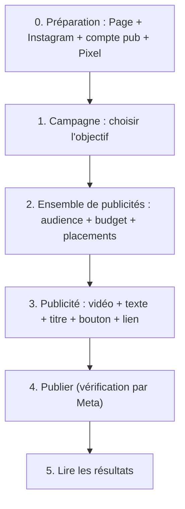
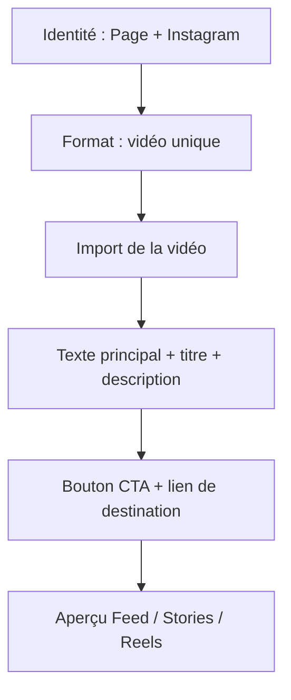
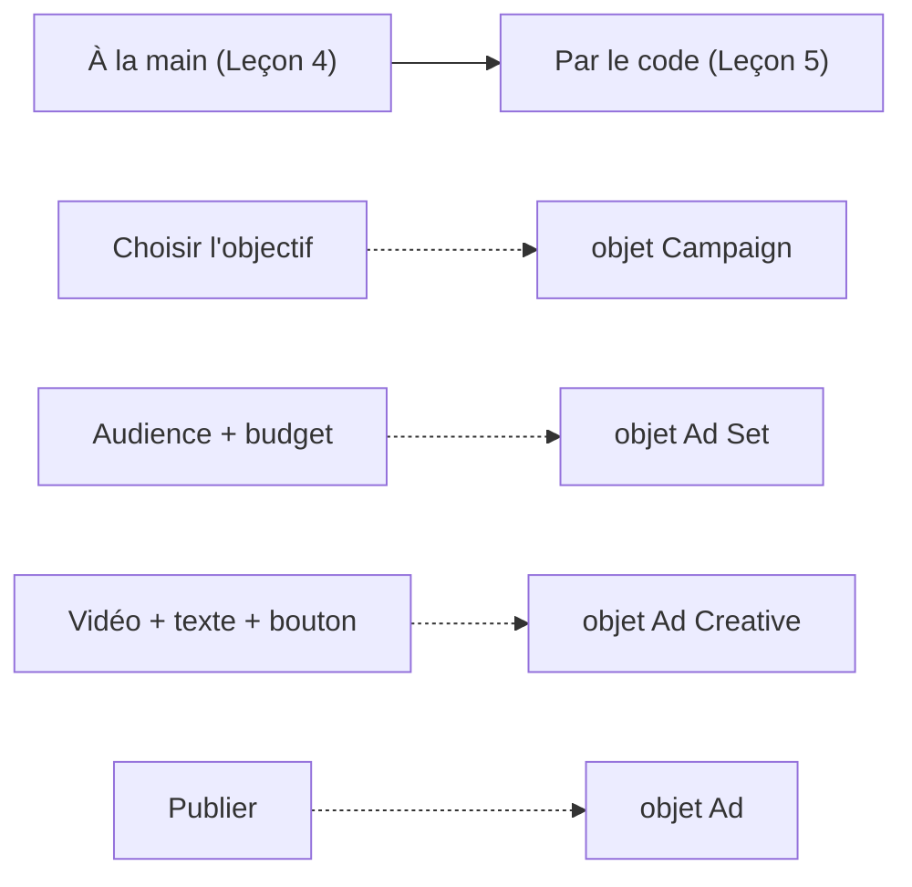

# Leçon 4 — Créer une publicité Instagram de A à Z, à la main

> [!TIP]
> **Objectif de la Leçon 4 — Créer et publier une vraie publicité, sans une seule ligne de code.**
>
> C'est la leçon la plus importante pour « tout le monde » : à la fin, n'importe qui — même non programmeur — sait créer une publicité Instagram complète dans le Gestionnaire de publicités de Meta.
>
> Tu vas suivre le parcours réel, clic par clic :
> 1. **Préparer** ton compte (Page + Instagram + compte publicitaire + Pixel).
> 2. Créer la **campagne** (objectif).
> 3. Créer l'**ensemble de publicités** (audience, budget, placements).
> 4. Créer la **publicité** (vidéo, texte, bouton, lien).
> 5. **Publier**, puis **lire les résultats**.
>
> Phrase clé : **ce que tu fais ici à la main, tu le feras automatiquement en Leçon 5 et 6. Comprends-le bien maintenant.**

## 4.1 Vue d'ensemble du parcours de création

Avant de cliquer, garde en tête que la création suit exactement la hiérarchie de la Leçon 1 : campagne, puis ensemble de publicités, puis publicité. Le Gestionnaire de publicités (Meta Ads Manager) te fait remplir ces trois étages dans l'ordre.

## 4.2 Étape 0 — Préparer son compte

Avant de pouvoir créer quoi que ce soit, quatre éléments (vus en Leçon 1) doivent exister et être reliés entre eux. Cette préparation évite 90 % des blocages que rencontrent les débutants.

Il te faut : une **Page Facebook** (l'identité qui signe la pub), un **compte Instagram professionnel** connecté à cette Page, un **compte publicitaire** avec un moyen de paiement valide, et idéalement un **Pixel** déjà installé sur ta page de vente (Leçon 2) pour pouvoir mesurer les conversions. Vérifie aussi que tu as bien les droits d'administrateur sur ces ressources dans le Business Manager, sinon Meta refusera certaines actions.

> [!NOTE]
> **Erreur classique.** Beaucoup de débutants tentent de lancer une pub Instagram sans avoir connecté le compte Instagram à la Page. Résultat : Instagram n'apparaît pas comme identité disponible. Connecte les deux **avant** de commencer, dans les paramètres du Business Manager.

## 4.3 Étape 1 — Créer la campagne (l'objectif)

Dans le Gestionnaire de publicités, tu cliques sur « Créer ». La première décision est l'**objectif**, c'est-à-dire le « pourquoi » de la Leçon 3. Pour vendre notre « Formation IA débutant », tu choisis généralement **Ventes** (si ton Pixel suit bien les achats) ou **Prospects** (si tu veux d'abord récolter des emails).

À ce niveau, tu donnes aussi un **nom clair** à la campagne. Un bon nom suit une convention qui te servira plus tard pour l'automatisation, par exemple : `Formation-IA | Ventes | Canada`. Tu ne touches encore ni à l'audience, ni au budget détaillé, ni au visuel : la campagne ne fixe que l'intention.

## 4.4 Étape 2 — Créer l'ensemble de publicités (audience, budget, placements)

C'est l'étage du « à qui, où, combien, quand ». Tu y configures successivement plusieurs blocs.

D'abord, la **conversion** : tu indiques où doit se produire le résultat (par exemple sur ton site web) et quel **événement** optimiser (par exemple `Purchase` ou `Lead`, selon la Leçon 2). Ensuite, le **budget** : tu choisis un budget quotidien (par exemple 20 $/jour pour commencer) et un calendrier. Puis l'**audience** : pays (Canada, France), tranche d'âge (25-45 ans), langue et centres d'intérêt, ou une audience personnalisée/similaire si tu en as. Enfin, les **placements** : tu peux laisser Meta optimiser automatiquement, ou choisir manuellement pour ne garder qu'Instagram (Feed, Stories, Reels, Explore).

> [!NOTE]
> **Conseil débutant.** Pour une première campagne, garde une audience pas trop étroite et un budget modeste. Tu n'apprends rien d'un budget de 5 $ sur une audience de 200 personnes, et tu risques de gaspiller avec un gros budget sur une cible non testée. Commence petit, observe, ajuste.

## 4.5 Étape 3 — Créer la publicité (le contenu visible)

C'est l'étage que verra l'utilisateur. Tu choisis d'abord l'**identité** : la Page Facebook et le compte Instagram qui signeront l'annonce. Puis tu sélectionnes le **format** (par exemple une vidéo unique) et tu **importes ta vidéo** (celle conçue selon la structure de la Leçon 3).

Tu rédiges ensuite les textes : le **texte principal** (au-dessus ou sous la vidéo), le **titre** (court et percutant), et éventuellement une **description**. Tu choisis le **bouton d'appel à l'action** (par exemple « En savoir plus » ou « S'inscrire ») et tu colles le **lien de destination** vers ta page de vente. Un aperçu te montre en direct le rendu sur le Feed, les Stories et les Reels : vérifie-le sur chaque placement, car un texte trop long peut être coupé en Story.

## 4.6 Étape 4 — Publier et passer la vérification

Une fois tout rempli, tu cliques sur **Publier**. Ta publicité n'est pas diffusée immédiatement : elle passe d'abord en **vérification**, un contrôle automatique (parfois humain) qui s'assure qu'elle respecte les règles publicitaires de Meta. Cette étape prend généralement de quelques minutes à quelques heures.

Si la publicité est **approuvée**, elle commence à être diffusée. Si elle est **refusée**, Meta indique la raison (par exemple un texte non conforme, une promesse interdite, une image problématique) : tu corriges et tu republies. Il est normal d'avoir des refus au début ; l'important est de lire le motif et d'ajuster.

> [!NOTE]
> **Astuce sécurité.** Tu peux créer la publicité en statut **« en pause »** et ne l'activer qu'après une dernière relecture. C'est une bonne habitude, surtout quand tu passeras à l'automatisation : on prépare en pause, on vérifie, puis on active.

## 4.7 Étape 5 — Lire les premiers résultats

Une fois la diffusion lancée, le Gestionnaire de publicités affiche des colonnes de résultats. Les indicateurs essentiels à comprendre sont les suivants :

| Indicateur | Signification |
|-----------|---------------|
| Impressions | Nombre de fois où la pub a été affichée |
| Portée (Reach) | Nombre de personnes uniques touchées |
| Clics | Nombre de clics sur la pub |
| CTR | Taux de clic (clics ÷ impressions) |
| CPC | Coût par clic |
| CPM | Coût pour mille impressions |
| Dépense | Montant total dépensé |
| Résultats | Conversions selon ton objectif (leads, achats) |
| Coût par résultat | Dépense ÷ nombre de résultats |

La lecture de base : un **CTR faible** signifie souvent que ta vidéo ou ton accroche n'accroche pas (problème de créatif). Un **CTR correct mais peu de ventes** signale souvent un problème de page de vente ou d'offre. Un **coût par résultat trop élevé** indique qu'il faut tester un autre angle, une autre audience ou couper la publicité. C'est exactement la logique des tests A/B de la Leçon 3.

## 4.8 Le lien direct avec l'automatisation

Cette leçon n'est pas qu'un tutoriel manuel : c'est la **carte** de tout ce que l'automatisation reproduira. Chaque chose que tu as remplie à la main correspond à un objet technique que la Marketing API manipulera en Leçon 5.

Autrement dit : ce que le Gestionnaire affiche sous forme de formulaires, l'API l'exprime sous forme d'objets (`Campaign`, `Ad Set`, `Ad Creative`, `Ad`). Si tu as bien compris les étapes manuelles, l'API ne sera qu'une autre façon de faire la même chose, beaucoup plus rapide et répétable.

## Recap

> [!TIP]
> **Avant la Leçon 5, assure-toi de savoir faire, concrètement :**
>
> 1. **Préparer** ton compte : Page + Instagram connectés + compte publicitaire + Pixel.
> 2. Créer une **campagne** et choisir le bon objectif.
> 3. Configurer un **ensemble de publicités** : événement optimisé, budget, audience, placements.
> 4. Monter une **publicité** : identité, vidéo, texte, titre, bouton, lien.
> 5. **Publier**, comprendre la **vérification** et gérer un refus.
> 6. **Lire les résultats** (CTR, CPC, coût par résultat) et décider quoi ajuster.
> 7. Relier chaque étape manuelle à son **objet d'API** correspondant.
>
> **Retiens : tu sais maintenant créer une pub de A à Z. La suite ne fait qu'automatiser ce geste.**

Dans la **Leçon 5**, on reproduit exactement ce parcours, mais par le code, avec la **Meta Marketing API** : tokens, permissions, et les objets Campaign, Ad Set, Creative et Ad.
