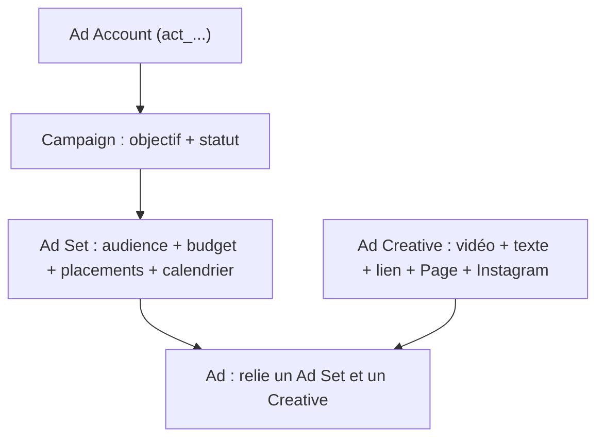
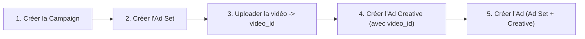

# Leçon 5 — Meta Marketing API : créer des publicités par le code

> [!TIP]
> **Objectif de la Leçon 5 — Reproduire la Leçon 4, mais par le code.**
>
> Tu sais créer une publicité à la main. Ici, tu apprends à faire la même chose avec la **Meta Marketing API**, c'est-à-dire en envoyant des requêtes plutôt qu'en cliquant. C'est le pont entre la création manuelle et l'automatisation complète de la Leçon 6.
>
> À la fin, tu sauras :
> 1. Créer une **app Meta Developer** et obtenir un **token** avec les bonnes **permissions**.
> 2. Comprendre les objets `Campaign`, `Ad Set`, `Ad Creative`, `Ad`.
> 3. Connaître la logique d'**upload vidéo** et de **reporting** (Insights).
> 4. Anticiper les **erreurs** fréquentes et appliquer les **bonnes pratiques de sécurité**.
>
> Phrase clé : **l'API ne fait rien de magique ; elle remplit les mêmes champs que toi, mais en JSON.**

## 5.1 C'est quoi la Marketing API

La Meta Marketing API est un ensemble de points d'entrée (« endpoints ») de la Graph API de Meta qui permettent de **créer et gérer des publicités par programmation**. Tout ce que tu fais dans le Gestionnaire de publicités — créer une campagne, définir une audience, importer une vidéo, publier une annonce, lire les statistiques — peut être fait par une requête HTTP.

Il est crucial de ne pas la confondre avec l'**API Conversions** de la Leçon 2 : la CAPI sert à **envoyer des événements vers Meta** (« quelqu'un a acheté »), tandis que la Marketing API sert à **donner des ordres de création et de gestion** (« crée cette campagne »). Les deux sont complémentaires mais répondent à des besoins opposés.

| API | Direction | Sert à |
|-----|-----------|--------|
| API Conversions | Toi → Meta (données) | Remonter les événements |
| Marketing API | Toi → Meta (commandes) | Créer et piloter les publicités |

## 5.2 L'app Meta Developer, les tokens et les permissions

Pour parler à l'API, Meta exige que tu t'identifies via une **application** créée sur la plateforme Meta for Developers. Cette app reçoit un **jeton d'accès** (« access token »), une sorte de mot de passe temporaire qui prouve que tu as le droit d'agir.

Une app passe par un **mode développement** (pour tester avec tes propres comptes) puis un **mode live** (pour une utilisation réelle, souvent après une vérification de l'entreprise, la « Business Verification »). Il existe plusieurs types de tokens : le **token utilisateur** (lié à une personne, expire vite) et le **token système** (lié au Business, plus stable pour l'automatisation). Pour gérer des publicités, la permission clé est **`ads_management`**, qui autorise la lecture et la gestion des publicités des comptes auxquels tu as accès.

> [!NOTE]
> **Le token, c'est une clé.** Un token d'accès donne le pouvoir de dépenser ton argent publicitaire. Traite-le comme une clé de coffre : jamais dans un fichier public, jamais dans un Google Sheets, jamais dans du code partagé. On verra en 5.7 et en Leçon 6 où le ranger correctement.

## 5.3 Les objets de l'API

L'API expose exactement la même hiérarchie que celle que tu as remplie à la main. Comprendre les objets, c'est comprendre l'API.

L'objet **Campaign** porte le nom, l'objectif et le statut (actif ou en pause). L'objet **Ad Set** porte l'audience, le budget, le calendrier, l'optimisation, les placements, l'« billing event » (ce qui est facturé) et le « promoted object » (ce qui est promu, par exemple le Pixel et l'événement à optimiser). L'objet **Ad Creative** contient les données qui décrivent l'apparence de l'annonce : la vidéo ou l'image, les textes, le lien, le bouton, l'identifiant de la Page et celui du compte Instagram. Enfin l'objet **Ad** est l'annonce finale : il relie un Ad Set, un Creative et un statut.

## 5.4 La logique de création par le code

Quand tu crées une publicité par l'API, tu suis l'ordre de la hiérarchie : on ne peut pas créer un Ad Set sans campagne, ni une Ad sans Creative. La séquence est donc toujours la même.

Chaque étape renvoie un **identifiant** (un `id`) que l'étape suivante réutilise. Par exemple, créer la campagne renvoie un `campaign_id` que tu passes à l'Ad Set ; uploader la vidéo renvoie un `video_id` que tu passes au Creative. Cette chaîne d'identifiants est le cœur du mécanisme, et c'est exactement ce que n8n orchestrera en Leçon 6.

## 5.5 L'upload vidéo via l'API

Une vidéo ne peut pas être collée directement dans une publicité : il faut d'abord la **téléverser** vers Meta, qui la **traite** (encodage, vérification) et renvoie un `video_id`. Ce n'est qu'ensuite que tu peux créer un Creative référençant cette vidéo, puis l'Ad.

Une publicité vidéo peut donc être construite de deux manières : à partir d'une **vidéo nouvellement téléversée** (tu envoies le fichier, tu attends le traitement, tu récupères le `video_id`), ou à partir d'une **vidéo existante** déjà présente dans ton compte (tu connais déjà son `video_id`). Un piège classique est de vouloir créer le Creative trop tôt, avant que la vidéo soit complètement traitée : il faut attendre que Meta confirme que la vidéo est prête.

## 5.6 Le reporting avec l'Insights API

L'API ne sert pas qu'à créer : elle sert aussi à **lire les performances**, via l'« Insights API ». Tu peux récupérer par le code les mêmes indicateurs que ceux affichés dans le Gestionnaire (Leçon 4) : impressions, portée (reach), clics, CTR, CPC, CPM, dépense (spend), résultats (leads, achats), coût par résultat et ROAS.

Cela permet d'automatiser non seulement la **création** mais aussi le **pilotage** : un système peut lire les performances, repérer une publicité dont le coût par résultat est trop élevé, et la mettre en pause automatiquement — ou au contraire augmenter le budget d'une gagnante. C'est la base d'une automatisation intelligente.

## 5.7 Les erreurs fréquentes

Travailler avec l'API expose à des erreurs récurrentes qu'il vaut mieux connaître à l'avance :

- **Token expiré** : le jeton n'est plus valide, il faut le régénérer.
- **Permission manquante** : il manque `ads_management` ou un accès au compte.
- **Compte publicitaire non autorisé** : l'app n'a pas accès à ce `act_...`.
- **Page non connectée** ou **compte Instagram non lié** : l'identité du Creative est invalide.
- **Vidéo non traitée** ou **mauvais format** : on a créé le Creative trop tôt.
- **Budget trop bas** : sous le minimum autorisé par Meta.
- **Objectif ou placement incompatible** : certaines combinaisons sont interdites.
- **Publicité rejetée** : non-respect des règles publicitaires.

La bonne pratique est de **lire le message d'erreur de Meta** (il est généralement explicite) et de **journaliser** chaque erreur pour pouvoir la corriger, plutôt que de relancer aveuglément la requête.

## 5.8 Les bonnes pratiques de sécurité

Comme un token permet de dépenser de l'argent, la sécurité n'est pas optionnelle. Les principes essentiels : **ne jamais** écrire le token en clair dans un fichier de données (Google Sheets, Airtable) ni dans du code partagé ; le **stocker dans un espace sécurisé** (les « credentials » de n8n, un gestionnaire de secrets) ; **limiter les permissions** au strict nécessaire ; **tester d'abord avec un petit budget** ; **créer en pause** puis activer après vérification ; et toujours prévoir un **garde-fou** pour ne pas créer accidentellement des dizaines de campagnes. Ces règles deviendront concrètes dans le projet de la Leçon 6.

## Recap

> [!TIP]
> **Avant la Leçon 6, assure-toi de pouvoir réexpliquer :**
>
> 1. La différence entre **Marketing API** (créer) et **API Conversions** (mesurer).
> 2. Le rôle de l'**app Meta Developer**, des **tokens** et de la permission **`ads_management`**.
> 3. Les objets **Campaign, Ad Set, Ad Creative, Ad** et leur hiérarchie.
> 4. La **séquence de création** et la chaîne d'**identifiants** (`campaign_id`, `video_id`...).
> 5. La logique d'**upload vidéo** (téléverser -> attendre le traitement -> `video_id`).
> 6. Le **reporting** via l'Insights API.
> 7. Les **erreurs fréquentes** et comment les diagnostiquer.
> 8. Les **bonnes pratiques de sécurité** (ne jamais exposer un token).
>
> **Retiens : l'API remplit les mêmes champs que toi, mais en JSON.**

Dans la **Leçon 6**, on assemble tout : une ligne dans Google Sheets ou Airtable, lue par n8n, déclenche les appels à la Marketing API et publie une vraie publicité Instagram, automatiquement.
