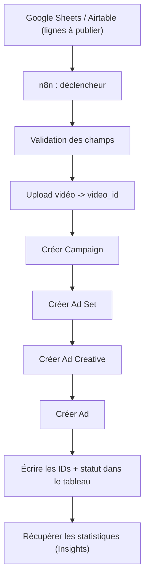
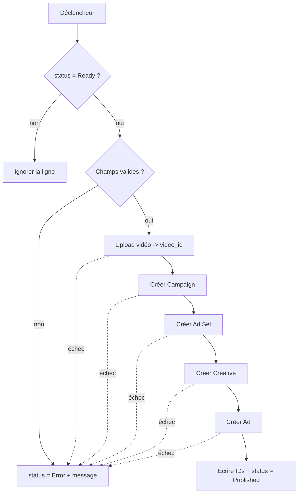
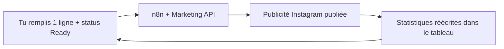

# Leçon 6 — Projet final : Google Sheets/Airtable → n8n → Meta Marketing API

> [!TIP]
> **Objectif de la Leçon 6 — Transformer une ligne de tableau en publicité Instagram, automatiquement.**
>
> C'est l'aboutissement de toute la formation. Tu assembles les six leçons en un seul système : tu remplis une ligne, tu mets le statut « Ready », et le système crée la campagne, l'ensemble de publicités, le créatif et la publicité, puis écrit les résultats.
>
> À la fin, tu sauras :
> 1. Concevoir l'**architecture** Google Sheets/Airtable → n8n → Marketing API.
> 2. Définir la **table de données** qui décrit une publicité.
> 3. Construire le **workflow n8n** étape par étape.
> 4. Gérer la **vidéo**, le **budget**, les **erreurs** et le **reporting** de façon sûre.
>
> Phrase clé : **une ligne du tableau = une publicité. Le tableau devient ton tableau de bord.**

## 6.1 L'architecture du projet

Le système repose sur trois briques. Un **tableau** (Google Sheets ou Airtable) où tu décris chaque publicité à créer. Un **orchestrateur** (n8n) qui lit le tableau et enchaîne les actions. Et la **Marketing API** de Meta (Leçon 5) qui crée réellement les publicités. n8n joue le rôle de chef d'orchestre entre le tableau et Meta.

n8n dispose de nœuds prêts à l'emploi pour **Google Sheets** (créer, lire, mettre à jour, supprimer des lignes) et pour **Airtable** (créer, lister, mettre à jour, supprimer des enregistrements). Pour appeler la Marketing API, on utilise le nœud **HTTP Request**, qui envoie des requêtes avec en-têtes, corps JSON ou fichiers binaires selon le besoin.

## 6.2 La structure de la table de données

La table est le cœur du système : chaque colonne correspond à un champ que tu as rempli à la main en Leçon 4. Voici les colonnes recommandées.

| Colonne | Description |
|---------|-------------|
| `campaign_name` | Nom de la campagne |
| `objective` | Objectif Meta (Ventes, Prospects...) |
| `adset_name` | Nom de l'ensemble de publicités |
| `ad_name` | Nom de la publicité |
| `daily_budget` | Budget quotidien |
| `country` | Pays ciblé |
| `age_min` / `age_max` | Tranche d'âge |
| `placement` | Feed, Reels, Stories |
| `video_url` | URL de la vidéo (ou `video_id` si déjà hébergée) |
| `primary_text` | Texte principal |
| `headline` | Titre |
| `description` | Description |
| `call_to_action` | Bouton |
| `landing_page_url` | Page de destination |
| `page_id` | Page Facebook |
| `instagram_account_id` | Compte Instagram |
| `status` | Draft, Ready, Published, Error |
| `meta_campaign_id` | ID de la campagne créée |
| `meta_adset_id` | ID de l'ensemble créé |
| `meta_creative_id` | ID du créatif créé |
| `meta_ad_id` | ID de la publicité créée |
| `error_message` | Message d'erreur éventuel |

La colonne `status` est centrale : c'est elle qui pilote le système. Une ligne en `Draft` est ignorée ; une ligne en `Ready` est traitée ; le système la passe ensuite en `Published` ou en `Error`.

## 6.3 Le workflow n8n étape par étape

Le workflow suit la séquence de création de la Leçon 5, avec des garde-fous. Voici les étapes logiques :

1. **Déclencheur** : une ligne est ajoutée ou modifiée (ou un déclenchement planifié qui scanne les lignes `Ready`).
2. **Filtrer** : ne traiter que les lignes dont `status = Ready`.
3. **Valider** : vérifier que les champs obligatoires sont remplis (vidéo, budget, page, Instagram, lien).
4. **Vidéo** : récupérer la vidéo (par `video_url`) et la téléverser vers Meta, puis attendre le `video_id`.
5. **Créer la Campaign** (HTTP Request) et récupérer `meta_campaign_id`.
6. **Créer l'Ad Set** avec le budget et l'audience, récupérer `meta_adset_id`.
7. **Créer l'Ad Creative** avec le `video_id`, les textes, le bouton et le lien, récupérer `meta_creative_id`.
8. **Créer l'Ad** reliant l'Ad Set et le Creative, récupérer `meta_ad_id`.
9. **Écrire** tous les IDs Meta dans la ligne et passer `status` à `Published`.
10. **En cas d'erreur**, écrire `status = Error` et le message dans `error_message`.

## 6.4 Google Sheets ou Airtable : lequel choisir

Les deux fonctionnent ; le choix dépend de ton niveau et de tes besoins. **Google Sheets** est simple, rapide et accessible, parfait pour un prototype et pour débuter ; en revanche, il est moins structuré, sa validation est faible et il gère mal les fichiers à grande échelle. **Airtable** est plus proche d'une vraie base de données : champs typés, pièces jointes, vues filtrées, statuts plus propres, meilleur pour la production ; il demande un peu plus de configuration et impose parfois des limites d'API.

> [!NOTE]
> **Recommandation.** Commence avec **Google Sheets** pour comprendre le flux sans friction. Quand ton système devient sérieux (beaucoup de lignes, plusieurs personnes, vidéos en pièces jointes), migre vers **Airtable** pour la robustesse.

## 6.5 La gestion de la vidéo

Deux approches coexistent selon ce que contient ta table. Dans l'**approche par URL**, la colonne `video_url` pointe vers un fichier (par exemple `https://monsite.com/videos/formation-ia.mp4`) ; n8n télécharge la vidéo puis l'envoie à Meta, attend le traitement et récupère le `video_id`. Dans l'**approche par vidéo déjà hébergée**, la table contient directement un `video_id` (par exemple `987654321`) ; le workflow saute l'upload et crée le Creative immédiatement. La première est plus souple pour de nouvelles vidéos ; la seconde est plus rapide pour réutiliser des vidéos existantes.

## 6.6 La gestion du budget

Le budget vient de la colonne `daily_budget`. Attention à un piège important : dans plusieurs API publicitaires, les montants sont exprimés dans la **plus petite unité monétaire** (souvent les cents). Un budget de 20 $ peut donc devoir être envoyé comme `2000`. Avant tout lancement réel, vérifie la logique exacte de ton compte publicitaire et de sa devise, car une erreur d'unité peut multiplier ou diviser ton budget par cent.

## 6.7 La gestion des textes et des variantes

La table peut contenir un seul texte ou plusieurs variantes pour faire des tests A/B (Leçon 3). Par exemple :

| Variante | Texte |
|----------|-------|
| A | Apprenez l'IA de zéro avec des projets concrets |
| B | Transformez vos compétences avec une formation IA pratique |
| C | Une formation claire pour maîtriser ChatGPT et l'automatisation |

Le système peut alors créer une publicité par variante, toutes rattachées au même ensemble, ce qui permet à Meta de comparer et de favoriser la plus performante. C'est la puissance de l'automatisation : tester dix angles devient aussi simple qu'ajouter dix lignes.

## 6.8 La sécurité du projet

C'est le point à ne jamais négliger, car le système dépense de l'argent réel. Les règles : **ne jamais** mettre le token Meta dans Google Sheets ou Airtable ; stocker les tokens dans les **credentials de n8n** ; **limiter** les permissions au nécessaire ; **tester avec un petit budget** ; **publier d'abord en pause** et activer après vérification humaine ; **journaliser** toutes les erreurs ; et surtout, prévoir un **garde-fou** pour ne jamais créer des dizaines de campagnes par accident. Une validation humaine avant publication (par exemple un statut `Ready` posé manuellement) est la meilleure protection.

## 6.9 Le reporting automatisé

Une fois les publicités créées, le système peut boucler pour récupérer leurs performances via l'Insights API (Leçon 5) et les réécrire dans le tableau. Tu obtiens alors un tableau de bord vivant : chaque ligne affiche non seulement la publicité créée, mais aussi ses impressions, ses clics, sa dépense et son coût par résultat. À terme, le système peut même mettre en pause les publicités trop coûteuses et augmenter le budget des gagnantes, fermant ainsi la boucle complète : créer, mesurer, optimiser.

## 6.10 Le résultat final

Au bout de cette formation, ton flux de travail ressemble à ceci : tu remplis une ligne, tu mets le statut `Ready`, n8n lit la ligne, crée la campagne, ajoute la vidéo, crée l'ensemble, le créatif et la publicité, écrit les identifiants Meta, puis récupère les performances. Ce que tu faisais en plusieurs minutes de clics en Leçon 4, le système le fait pour autant de lignes que tu veux, de façon fiable et répétable.

## Recap

> [!TIP]
> **Tu as terminé la formation. Tu dois maintenant être capable de :**
>
> 1. Décrire l'**architecture** Sheets/Airtable → n8n → Marketing API.
> 2. Concevoir la **table de données** qui décrit une publicité, avec la colonne `status` pilote.
> 3. Construire le **workflow n8n** complet (déclencheur, validation, upload, création, écriture des IDs).
> 4. Choisir entre **Google Sheets** (prototype) et **Airtable** (production).
> 5. Gérer la **vidéo** (URL ou `video_id`) et le **budget** (attention à l'unité monétaire).
> 6. Mettre en place des **tests A/B** via des variantes de texte.
> 7. Appliquer les **règles de sécurité** (tokens dans n8n, publication en pause, garde-fous).
> 8. Automatiser le **reporting** pour boucler créer → mesurer → optimiser.
>
> **Retiens : une ligne du tableau = une publicité. Tu sais désormais créer des publicités Instagram de A à Z, à la main comme automatiquement.**

Félicitations : tu as parcouru tout le chemin, de la théorie de l'écosystème Meta (Leçon 1) jusqu'à un système automatisé complet (Leçon 6), en passant par le tracking, la stratégie, la création manuelle et l'API. Tu disposes maintenant des bases pour comprendre, créer et faire évoluer tes propres campagnes publicitaires Instagram.
