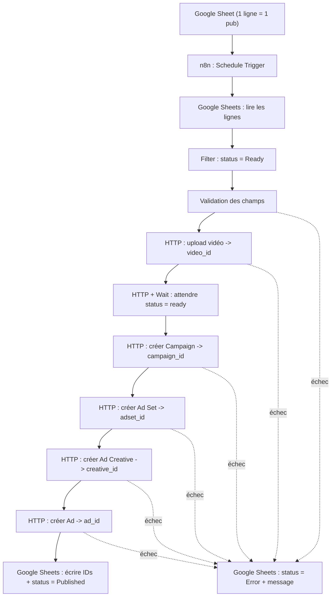
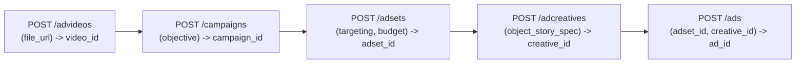

# Leçon 6 — Projet final ULTRA DÉTAILLÉ : Google Sheets → n8n → Meta Marketing API

> [!TIP]
> **Objectif — Construire, de tes mains, un système qui transforme une ligne de tableau en publicité Instagram.**
>
> Ce document est un **mode d'emploi pas à pas**. Tu peux le suivre du début à la fin sans rien deviner. Chaque nœud n8n est décrit avec son type, ses réglages exacts, l'URL appelée et le corps JSON envoyé à Meta.
>
> Tu trouveras aussi un **template n8n importable** : [`workflow-n8n-meta-ads.json`](workflow-n8n-meta-ads.json).
>
> **Important sur la version d'API.** Les exemples utilisent **Graph API `v25.0`** (version stable en 2026) et les objectifs **ODAX** (`OUTCOME_SALES`, `OUTCOME_LEADS`...). Depuis la v21.0, Meta n'accepte plus que ces objectifs ODAX. Vérifie toujours la version courante dans la documentation officielle avant un lancement réel.
>
> **Important sur l'argent.** Ce système dépense de l'argent réel. On crée donc TOUT en statut `PAUSED`, avec un budget minuscule, et on n'active jamais sans relecture humaine.

---

## Vue d'ensemble du système



---

# PARTIE 0 — Tout ce que tu dois rassembler AVANT de commencer

Avant de toucher à n8n, tu dois récupérer **7 informations**. Note-les dans un fichier sécurisé (jamais dans le Google Sheet du projet).

| # | Information | Exemple | Où la trouver |
|---|-------------|---------|---------------|
| 1 | ID du compte publicitaire | `act_123456789` | Gestionnaire de publicités → Paramètres du compte |
| 2 | ID de la Page Facebook | `100111222333` | Page → À propos, ou Business Settings → Pages |
| 3 | ID du compte Instagram pro | `178414...` | Business Settings → Comptes Instagram |
| 4 | ID du Pixel (dataset) | `987654321` | Gestionnaire d'événements → Paramètres du dataset |
| 5 | Token d'accès (longue durée) | `EAAB...` | App Meta Developer (voir 0.2) |
| 6 | Version d'API | `v25.0` | Documentation Meta |
| 7 | URL publique de ta vidéo | `https://.../video.mp4` | Ton hébergement (S3, site...) |

## 0.1 Préparer les ressources Meta (rappel Leçon 1 et 4)

Assure-toi que ces ressources existent ET sont reliées dans le **Business Manager** :
- Une **Page Facebook**.
- Un **compte Instagram professionnel** connecté à cette Page.
- Un **compte publicitaire** (`act_...`) avec un **moyen de paiement valide**.
- Un **Pixel** installé sur ta page de vente, qui reçoit déjà l'événement `Purchase` ou `Lead` (Leçon 2).

> [!NOTE]
> **Vérifie les droits.** Dans Business Settings, ton utilisateur (ou l'utilisateur système, voir ci-dessous) doit avoir un accès complet au compte publicitaire, à la Page et au compte Instagram. 90 % des erreurs `(#200) Permissions error` viennent d'un accès manquant ici.

## 0.2 Créer l'app et obtenir un token (étape la plus délicate)

1. Va sur **developers.facebook.com** → **My Apps** → **Create App** → type **« Business »**.
2. Dans l'app, ajoute le produit **Marketing API**.
3. Pour une automatisation stable, crée un **utilisateur système** dans **Business Settings → Users → System Users** :
   - Crée un « System User » (type Admin de préférence).
   - Clique **Add Assets** et donne-lui accès au **compte publicitaire**, à la **Page** et au **compte Instagram**.
   - Clique **Generate New Token**, choisis ton app, et coche les permissions :
     - `ads_management` (obligatoire — créer/gérer les pubs)
     - `ads_read` (lire les stats)
     - `business_management` (gérer les ressources)
     - `pages_read_engagement` / `pages_manage_ads` (selon besoin pour la Page)
   - Copie le **token** généré (il s'affiche une seule fois).

> [!NOTE]
> **Token utilisateur vs token système.** Un token d'utilisateur normal expire vite (1 à 2 h, ou 60 jours en version longue). Le **token d'utilisateur système** est conçu pour les automatisations et ne change pas tant que tu ne le régénères pas. C'est celui à utiliser ici.

## 0.3 Vérifier le token avec un appel de test

Avant n8n, teste ton token dans un terminal (ou Postman). Si cette commande renvoie le nom de ton compte, tout est bon :

```bash
curl -G "https://graph.facebook.com/v25.0/act_123456789" \
  -d "fields=name,account_status,currency" \
  -d "access_token=TON_TOKEN"
```

Réponse attendue (exemple) :

```json
{ "name": "Mon compte pub", "account_status": 1, "currency": "CAD", "id": "act_123456789" }
```

Retiens bien la **devise** (`currency`) : elle détermine l'unité du budget (voir Partie 4.3).

---

# PARTIE 1 — Construire le Google Sheet

Crée un Google Sheet nommé `meta-ads-pipeline`, avec une feuille `campagnes`. La **première ligne** contient exactement ces en-têtes de colonnes :

```
campaign_name | objective | adset_name | ad_name | daily_budget | country | age_min | age_max | placement | optimization_event | video_url | primary_text | headline | description | call_to_action | landing_page_url | status | meta_campaign_id | meta_adset_id | meta_video_id | meta_creative_id | meta_ad_id | error_message
```

## 1.1 Exemple de ligne remplie (fil rouge « Formation IA »)

| Colonne | Valeur |
|---------|--------|
| `campaign_name` | `Formation-IA \| Ventes \| CA-FR` |
| `objective` | `OUTCOME_SALES` |
| `adset_name` | `25-45 \| CA-FR \| Reels` |
| `ad_name` | `Video1 - Apprendre IA de zero` |
| `daily_budget` | `2000` *(= 20,00 $ en cents, voir 4.3)* |
| `country` | `CA,FR` |
| `age_min` | `25` |
| `age_max` | `45` |
| `placement` | `instagram` |
| `optimization_event` | `PURCHASE` |
| `video_url` | `https://monsite.com/videos/ia.mp4` |
| `primary_text` | `Apprenez l'IA de zéro avec des projets concrets.` |
| `headline` | `Formation IA débutant` |
| `description` | `Accès à vie + exercices guidés` |
| `call_to_action` | `LEARN_MORE` |
| `landing_page_url` | `https://monsite.com/formation-ia` |
| `status` | `Ready` |
| (colonnes `meta_*` et `error_message`) | *(laissées vides, remplies par n8n)* |

## 1.2 Règle d'or de la colonne `status`

C'est cette colonne qui pilote tout :
- `Draft` → ligne ignorée (en cours de préparation).
- `Ready` → **n8n la traite**.
- `Published` → publicité créée avec succès (n8n a écrit les IDs).
- `Error` → un problème est survenu (n8n a écrit `error_message`).

Tu ne mets `Ready` **que** lorsque la ligne est complète et relue. C'est ton garde-fou anti-dépense accidentelle.

---

# PARTIE 2 — Préparer n8n et ses credentials

## 2.1 Credential pour Meta (Header Auth)

Dans n8n → **Credentials** → **New** → cherche **« Header Auth »** :
- **Name** : `Meta Graph Token`
- **Name (header)** : `Authorization`
- **Value** : `Bearer TON_TOKEN_SYSTEME`

> [!NOTE]
> **Pourquoi un header et pas le Sheet ?** Le token ne doit JAMAIS être dans le Google Sheet ni écrit en clair dans un nœud. En le mettant dans un credential n8n, il est chiffré et réutilisable par tous les nœuds HTTP sans jamais apparaître dans tes données.

## 2.2 Credential Google Sheets

Crée une credential **Google Sheets OAuth2** (connecte ton compte Google et autorise l'accès aux feuilles). Elle servira aux nœuds de lecture et d'écriture.

## 2.3 Variables réutilisables

Pour ne pas répéter ton `act_id` et la version partout, tu peux créer un nœud **« Set »** au début qui définit des variables, ou utiliser les **Variables/Environment** de n8n. Dans ce guide, on suppose ces deux valeurs :
- `AD_ACCOUNT = act_123456789`
- `API = https://graph.facebook.com/v25.0`

---

# PARTIE 3 — Le workflow n8n, nœud par nœud

Voici les 11 nœuds, dans l'ordre. Pour chaque nœud HTTP vers Meta : méthode **POST**, **Authentication = Header Auth → Meta Graph Token**, **Send Body = ON**, **Body Content Type = Form-Urlencoded** (le plus simple avec la Graph API).

## Nœud 1 — Schedule Trigger

- Type : **Schedule Trigger**.
- Réglage : toutes les 15 minutes (ou « Manual » pendant les tests).
- Rôle : lancer le workflow régulièrement pour repérer les nouvelles lignes `Ready`.

## Nœud 2 — Google Sheets : Get row(s)

- Type : **Google Sheets** → Operation **Get Row(s)**.
- Document : `meta-ads-pipeline`, Sheet : `campagnes`.
- Rôle : récupérer toutes les lignes du tableau.

## Nœud 3 — Filter : status = Ready

- Type : **Filter**.
- Condition : `{{ $json.status }}` **equals** `Ready`.
- Rôle : ne laisser passer que les lignes prêtes. Les autres s'arrêtent ici.

## Nœud 4 — Validation des champs obligatoires

- Type : **IF** (ou un nœud **Code**).
- Condition (toutes vraies) : `video_url` non vide ET `daily_budget` non vide ET `landing_page_url` non vide ET `objective` non vide.
- Sortie **true** → continuer. Sortie **false** → aller au nœud d'erreur (Partie 3, gestion d'erreur).

## Nœud 5 — HTTP : Upload de la vidéo (`advideos`)

- Méthode : **POST**
- URL :
```
https://graph.facebook.com/v25.0/act_123456789/advideos
```
- Body (Form-Urlencoded) :

| Paramètre | Valeur (expression n8n) |
|-----------|--------------------------|
| `file_url` | `={{ $json.video_url }}` |
| `name` | `={{ $json.ad_name }}` |

- Réponse : `{ "id": "VIDEO_ID" }`. **Ce `id` est le `video_id`.**

> [!NOTE]
> Si ta vidéo est déjà hébergée chez Meta (tu connais déjà son `video_id`), tu peux sauter ce nœud et utiliser directement la colonne `meta_video_id`.

## Nœud 6 — HTTP + Wait : attendre que la vidéo soit prête

Une vidéo fraîchement envoyée n'est pas immédiatement utilisable : Meta doit l'encoder. On ajoute donc une petite boucle d'attente.

- **Nœud Wait** : attendre 30 secondes.
- **Nœud HTTP (GET)** : vérifier le statut.
  - URL : `https://graph.facebook.com/v25.0/{{ $('Upload vidéo').item.json.id }}?fields=status`
  - Réponse : `{ "status": { "video_status": "ready" } }`
- **Nœud IF** : si `video_status` ≠ `ready`, reboucler vers Wait ; sinon continuer.

> [!NOTE]
> Pour un premier test, une simple attente fixe de 60 secondes suffit souvent. La boucle de vérification est la version « propre » pour la production.

## Nœud 7 — HTTP : Créer la Campaign

- Méthode : **POST**
- URL : `https://graph.facebook.com/v25.0/act_123456789/campaigns`
- Body :

| Paramètre | Valeur |
|-----------|--------|
| `name` | `={{ $json.campaign_name }}` |
| `objective` | `={{ $json.objective }}` *(ex. `OUTCOME_SALES`)* |
| `status` | `PAUSED` |
| `special_ad_categories` | `[]` |

- Réponse : `{ "id": "CAMPAIGN_ID" }`.

> [!NOTE]
> `special_ad_categories` est **obligatoire** (mettre `[]` si ta pub n'est pas dans une catégorie spéciale comme crédit, emploi, logement, politique). L'oublier renvoie une erreur.

## Nœud 8 — HTTP : Créer l'Ad Set

- Méthode : **POST**
- URL : `https://graph.facebook.com/v25.0/act_123456789/adsets`
- Body :

| Paramètre | Valeur |
|-----------|--------|
| `name` | `={{ $json.adset_name }}` |
| `campaign_id` | `={{ $('Créer Campaign').item.json.id }}` |
| `daily_budget` | `={{ $json.daily_budget }}` |
| `billing_event` | `IMPRESSIONS` |
| `optimization_goal` | `OFFSITE_CONVERSIONS` |
| `bid_strategy` | `LOWEST_COST_WITHOUT_CAP` |
| `promoted_object` | `={{ JSON.stringify({ pixel_id: "987654321", custom_event_type: $json.optimization_event }) }}` |
| `targeting` | *(voir ci-dessous)* |
| `status` | `PAUSED` |

- Valeur de `targeting` (Instagram uniquement) :
```
={{ JSON.stringify({
  geo_locations: { countries: $json.country.split(",") },
  age_min: Number($json.age_min),
  age_max: Number($json.age_max),
  publisher_platforms: ["instagram"],
  instagram_positions: ["stream","story","reels","explore_home"]
}) }}
```
- Réponse : `{ "id": "ADSET_ID" }`.

> [!NOTE]
> Le `promoted_object` (pixel + événement) et `optimization_goal: OFFSITE_CONVERSIONS` ne sont nécessaires que pour les objectifs de **conversion** (`OUTCOME_SALES`). Pour `OUTCOME_TRAFFIC`, on optimise par exemple sur `LINK_CLICKS` et on retire le `promoted_object`.

## Nœud 9 — HTTP : Créer l'Ad Creative

- Méthode : **POST**
- URL : `https://graph.facebook.com/v25.0/act_123456789/adcreatives`
- Body :

| Paramètre | Valeur |
|-----------|--------|
| `name` | `={{ $json.ad_name }} - creative` |
| `object_story_spec` | *(voir ci-dessous)* |

- Valeur de `object_story_spec` :
```
={{ JSON.stringify({
  page_id: "100111222333",
  instagram_user_id: "178414000000",
  video_data: {
    video_id: $('Upload vidéo').item.json.id,
    message: $json.primary_text,
    title: $json.headline,
    link_description: $json.description,
    call_to_action: {
      type: $json.call_to_action,
      value: { link: $json.landing_page_url }
    }
  }
}) }}
```
- Réponse : `{ "id": "CREATIVE_ID" }`.

> [!NOTE]
> `video_data` exige souvent une vignette. Meta en génère une automatiquement, mais tu peux fournir `image_url` (URL d'une image d'aperçu) pour contrôler la miniature. `instagram_user_id` est le champ moderne (anciennement `instagram_actor_id`).

## Nœud 10 — HTTP : Créer l'Ad

- Méthode : **POST**
- URL : `https://graph.facebook.com/v25.0/act_123456789/ads`
- Body :

| Paramètre | Valeur |
|-----------|--------|
| `name` | `={{ $json.ad_name }}` |
| `adset_id` | `={{ $('Créer Ad Set').item.json.id }}` |
| `creative` | `={{ JSON.stringify({ creative_id: $('Créer Creative').item.json.id }) }}` |
| `status` | `PAUSED` |

- Réponse : `{ "id": "AD_ID" }`. **La publicité existe maintenant (en pause).**

## Nœud 11 — Google Sheets : Update row

- Type : **Google Sheets** → Operation **Update Row**.
- Colonne de correspondance : la ligne courante (par exemple via `row_number`).
- Valeurs écrites :

| Colonne | Valeur |
|---------|--------|
| `status` | `Published` |
| `meta_campaign_id` | `={{ $('Créer Campaign').item.json.id }}` |
| `meta_adset_id` | `={{ $('Créer Ad Set').item.json.id }}` |
| `meta_video_id` | `={{ $('Upload vidéo').item.json.id }}` |
| `meta_creative_id` | `={{ $('Créer Creative').item.json.id }}` |
| `meta_ad_id` | `={{ $('Créer Ad').item.json.id }}` |

## Gestion des erreurs (sur chaque nœud HTTP)

Sur chaque nœud HTTP Meta, ouvre **Settings** et active **« Continue On Fail »**. Ajoute ensuite, sur la branche d'erreur, un nœud **Google Sheets : Update Row** qui écrit :

| Colonne | Valeur |
|---------|--------|
| `status` | `Error` |
| `error_message` | `={{ $json.error?.message || JSON.stringify($json) }}` |

Ainsi, une ligne qui échoue passe en `Error` avec le message exact de Meta, et le système continue avec les autres lignes au lieu de tout planter.

---

# PARTIE 4 — Référence des appels API (aide-mémoire)

## 4.1 Récapitulatif des 5 appels



## 4.2 Objectifs ODAX (`objective`)

| Valeur | Usage |
|--------|-------|
| `OUTCOME_SALES` | Ventes (avec Pixel + événement Purchase) |
| `OUTCOME_LEADS` | Prospects / récolte d'emails |
| `OUTCOME_TRAFFIC` | Trafic vers une page |
| `OUTCOME_ENGAGEMENT` | Interactions, vues vidéo |
| `OUTCOME_AWARENESS` | Notoriété |
| `OUTCOME_APP_PROMOTION` | Installations d'app |

## 4.3 L'unité du budget (piège classique)

`daily_budget` s'exprime dans la **plus petite unité de la devise** :
- Devise en dollars/euros (CAD, USD, EUR) → en **cents**. `2000` = **20,00 $**.
- Vérifie le **minimum** imposé par Meta (souvent quelques dollars par jour selon l'optimisation).

> [!NOTE]
> **Teste cette unité en premier.** Une erreur ici peut transformer « 20 $ » en « 2000 $ ». Commence avec `daily_budget = 100` ou `200` (1 à 2 $) pendant les tests, en statut PAUSED.

## 4.4 Boutons d'appel à l'action (`call_to_action`)

Valeurs courantes : `LEARN_MORE`, `SIGN_UP`, `SUBSCRIBE`, `GET_OFFER`, `BUY_NOW`, `DOWNLOAD`, `CONTACT_US`, `BOOK_TRAVEL`. Pour une formation, `LEARN_MORE` ou `SIGN_UP` sont les plus adaptés.

## 4.5 Objectifs d'optimisation (`optimization_goal`)

| Objectif campagne | `optimization_goal` typique | `billing_event` |
|-------------------|------------------------------|-----------------|
| `OUTCOME_SALES` | `OFFSITE_CONVERSIONS` | `IMPRESSIONS` |
| `OUTCOME_TRAFFIC` | `LINK_CLICKS` | `IMPRESSIONS` |
| `OUTCOME_LEADS` | `LEAD_GENERATION` ou `OFFSITE_CONVERSIONS` | `IMPRESSIONS` |

---

# PARTIE 5 — Importer le template n8n

1. Ouvre n8n → **Workflows** → bouton **«...» → Import from File**.
2. Sélectionne [`workflow-n8n-meta-ads.json`](workflow-n8n-meta-ads.json).
3. Le workflow apparaît avec tous les nœuds connectés.
4. **À adapter avant exécution** :
   - Sélectionne la credential **Header Auth** (`Meta Graph Token`) sur chaque nœud HTTP.
   - Sélectionne la credential **Google Sheets** et choisis ton document/feuille.
   - Remplace `act_123456789`, le `pixel_id` `987654321`, le `page_id` et l'`instagram_user_id` par **tes** valeurs (Partie 0).
5. Lance d'abord en mode **manuel** sur **une seule ligne** `Ready` avec un budget minuscule.

---

# PARTIE 6 — Plan de test (à suivre dans l'ordre)

1. **Token** : l'appel `curl` de la Partie 0.3 renvoie bien le nom du compte.
2. **Sheet** : une ligne complète, `status = Ready`, budget à `100` (1 $).
3. **Vidéo** : le nœud `advideos` renvoie un `id`, et le statut passe à `ready`.
4. **Campaign / Ad Set / Creative / Ad** : chaque nœud renvoie un `id` ; aucune erreur.
5. **Vérification visuelle** : ouvre le Gestionnaire de publicités → ta campagne existe, **en pause**, avec la bonne audience et la vidéo.
6. **Sheet mis à jour** : la ligne est passée en `Published` avec les 5 IDs.
7. Seulement après cette vérification : tu peux activer manuellement la pub (ou ajouter un nœud qui passe `status: ACTIVE` quand tu valides).

> [!NOTE]
> **Ne mets jamais `status: ACTIVE` dans le workflow tant que tu n'es pas sûr à 100 %.** La bonne pratique professionnelle est : le robot crée en PAUSE, un humain active.

---

# PARTIE 7 — Sécurité (à ne jamais négliger)

- Le **token** vit uniquement dans la credential n8n. Jamais dans le Sheet, jamais dans un nœud en clair, jamais sur GitHub.
- **Permissions minimales** : `ads_management` + `ads_read` suffisent pour ce projet.
- **Budget test** d'abord (1 à 2 $), tout en `PAUSED`.
- **Garde-fou** : le filtre `status = Ready` empêche le traitement accidentel. Ajoute si besoin une limite (« ne traiter que X lignes par exécution »).
- **Journalisation** : la colonne `error_message` garde la trace de chaque échec.
- **Validation humaine** avant toute activation réelle.

---

# PARTIE 8 — Erreurs fréquentes et solutions

| Message Meta | Cause probable | Solution |
|--------------|----------------|----------|
| `(#200) Permissions error` | Accès manquant au compte/Page/IG | Ajouter les assets à l'utilisateur système (0.2) |
| `Invalid OAuth access token` | Token expiré ou mal copié | Régénérer le token système |
| `special_ad_categories is required` | Champ oublié sur la campagne | Ajouter `special_ad_categories=[]` |
| `Video is not ready` | Creative créé trop tôt | Attendre `video_status = ready` (nœud 6) |
| `Invalid parameter` sur targeting | JSON mal formé | Vérifier `JSON.stringify` et les guillemets |
| `Budget too low` | `daily_budget` sous le minimum | Augmenter (attention aux cents, 4.3) |
| `Instagram account is not linked` | IG non relié à la Page | Connecter dans Business Settings |

---

## Recap

> [!TIP]
> **Tu disposes maintenant d'un projet complet et reproductible :**
>
> 1. Tu sais **rassembler** les 7 informations (token, IDs, pixel, vidéo).
> 2. Tu sais **construire le Google Sheet** piloté par la colonne `status`.
> 3. Tu sais **configurer n8n** (Header Auth pour le token, Google Sheets OAuth).
> 4. Tu sais **monter le workflow** : trigger → lecture → filtre → validation → upload vidéo → campaign → ad set → creative → ad → mise à jour.
> 5. Tu connais les **payloads exacts** de chaque appel `v25.0`.
> 6. Tu sais **importer le template**, **tester en PAUSE** et **gérer les erreurs**.
> 7. Tu appliques les **règles de sécurité** (le robot crée, l'humain active).
>
> **Une ligne du tableau = une publicité Instagram. Tu sais désormais le faire de A à Z, à la main comme en automatique.**

Le fichier [`workflow-n8n-meta-ads.json`](workflow-n8n-meta-ads.json) contient le squelette importable de ce workflow, prêt à être adapté avec tes identifiants.
